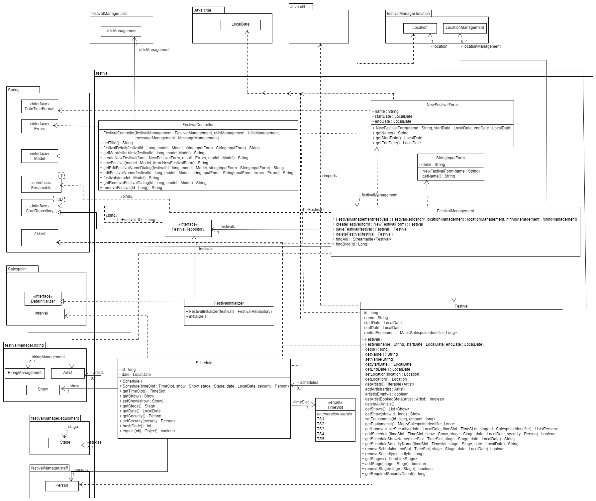

[options="header"]
[cols="1, 3, 3"]
|===
|Version | Bearbeitungsdatum   | Autor
|1.0	| 14.11.2021 | Adrian
|===

:numbered:

== Entwicklerdokumentation

== Einführung und Ziele
* Aufgabenstellung
* Qualitätsziele

== Randbedingungen
* Hardware-Vorgaben
* Software-Vorgaben
* Vorgaben zum Betrieb des Software

== Kontextabgrenzung
* Kontextdiagramm

== Lösungsstrategie
=== Erfüllung der Qualitätsziele
[options="header"]
|===
|Qualitätsziel |Lösungsansatz
|persistente Datenhaltung |Verwendung der javax Entities
|stabile Webanwendung|Verwendung des Spring Frameworks
|Wiederverwendung bestehender Lösungen|Verwendung des SalesPoint
|Wiederverwendbarkeit|komplette Programmierung in OOP und Bausteinen
|Fehlerfreiheit|Testen mit dem jUnit
|===

=== Softwarearchitektur

=== Entwurfsentscheidungen
* Verwendete Muster
Wir verwenden das Model- View- Controller- Muster des Spring Frameworks.
* Persistenz
Wir verwenden die Persistenz der javax- Entity Klassen.
* Benutzeroberfläche
Die Benutzeroberfläche ist eine HTML- Anwendung.
* Verwendung externer Frameworks

[options="header", cols="1,2"]
|===
|Externes Package |Verwendet von (Klasse der eigenen Anwendung)
|... |...
|===

== Bausteinsicht

=== Festival

[options="header"]
|===
|Klasse/Enumeration |Beschreibung
|Festival|Klasse, die Festivals als zentrale Objekte beschreibt
|FestivalManagement|Klasse, um Festival-Instanzen zu verwalten
|FestivalController|Spring MCV Controller, welcher Anfragen bezüglich Erstellung und Bearbeitung von Festivals verarbeitet
|FestivalRepository|Speicherortschnittstelle, um Festival-Instanzen zu speichern
|FestivalInitializer|Implementierung des DataInitializer, um Festivalvorlagen zu erstellen
|NewFestivalForm|Klasse, um Benutzereingabe bei der Festivalerstellung zu validieren
|Schedule|Klasse, die den Programmablauf des Festivals auf den jeweiligen Bühnen beschreibt 
|Map|Klasse, die den Beschrifteten Übersichtsplan über den Festivalort beschreibt
|Position|Klasse, die Bereiche auf dem Übersichtsplan beschreibt
|Area|Abstrakte Oberklasse aller möglichen Bereichsarten auf dem Übersichtsplan
|LockedArea|Klasse, um einen gesperrten Bereich zu beschreiben
|ParkingArea|Klasse, um einen Parkplatz zu beschreiben
|CateringArea|Klasse, um einen Imbissbereich zu beschreiben
|StageArea|Klasse, um einen Bühnenbereich zu beschreiben
|ToiletArea|Klasse, um einen Toiletenbereich zu beschreiben
|CampingArea|Klasse, um einen Zeltplatz zu beschreiben

|===

=== Location

image::models/design/developer_documentation/class_diagrams/location.png[]

[options="header"]
|===
|Klasse/Enumeration |Beschreibung
|Location|Klasse, die Locations als dem Festival hinzufügbare Objekte beschreibt
|LocationManagement|Klasse, um Location-Instanzen zu verwalten
|LocationController|Spring MVC Controller, welcher Anfragen bezüglich des anzeigens von Locations behandelt
|LocationRepository|Speicherortschnittstelle, um Location-Instanzen zu speichern
|LocationDataInitializer|Implementierung des Datainitializers, um bereitgestellte Locations zu erstellen
|GroundView|Klasse, die den Grundriss der Location enthält
|Bookings|Klasse, die Buchungen beschreibt, die einer Location zugewiesen werden können
|===

=== PaketName...

image::models/design/developer_documentation/class_diagrams/ticketshop.png[]

[options="header"]
|===
|Klasse/Enumeration |Beschreibung
|===

=== Staff

[options="header"]
|===
|Klasse/Enumeration |Beschreibung
|Person |Basisklasse für das Personal, die alle gemeinsamen Eigenschaften enthält
|Planner |Klasse, die den Planer repräsentiert
|AdmissionStaff |Klasse, die das Einlaspersonal repräsentiert
|TicketSeller |Klasse, die einen Ticketverkäufer repräsentiert
|CateringStaff |Klasse, die einen Catering Angestellten repräsentiert
|FestivalManager |Klasse, die den Festivalmanager repräsentiert
|FestivalLeader |Klasse, die den Festivalleiter repräsentiert
|MessagingSystem |Ein System zum speichern von internen Nachrichten
|StaffRepository |Speicherschnittstelle um die Personendaten zu speichern
|StaffController |Der Controller für das Webinterface zu verwaltung des Personals
|CreateStaffForm |Klasse, die das Formular um Personen zu erstellen repräsentiert
|CreateStaffForm |Klasse, die das Formular um Personen aus dem Repository zu entfernen repräsentiert
|===

=== Rückverfolgbarkeit zwischen Analyse- und Entwurfsmodell
_Die folgende Tabelle zeigt die Rückverfolgbarkeit zwischen Entwurfs- und Analysemodell. Falls eine Klasse aus einem externen Framework im Entwurfsmodell eine Klasse des Analysemodells ersetzt,
wird die Art der Verwendung dieser externen Klasse in der Spalte *Art der Verwendung* mithilfe der folgenden Begriffe definiert:_

* Inheritance/Interface-Implementation
* Class Attribute
* Method Parameter

[options="header"]
|===
|Klasse/Enumeration (Analysemodell) |Klasse/Enumeration (Entwurfsmodell) |Art der Verwendung
|...|...|...
|===

== Laufzeitsicht
* Darstellung der Komponenteninteraktion anhand eines Sequenzdiagramms, welches die relevantesten Interaktionen darstellt.

Planung:

== Technische Schulden
* Auflistung der nicht erreichten Quality Gates und der zugehörigen SonarQube Issues zum Zeitpunkt der Abgabe

