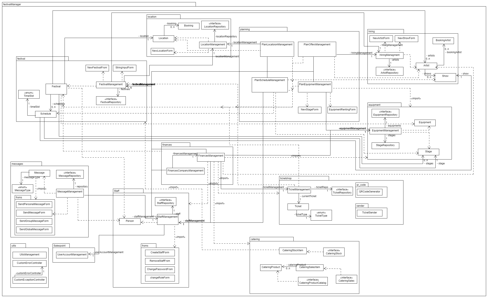
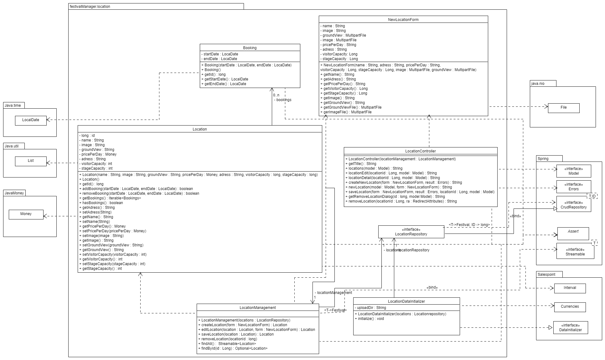
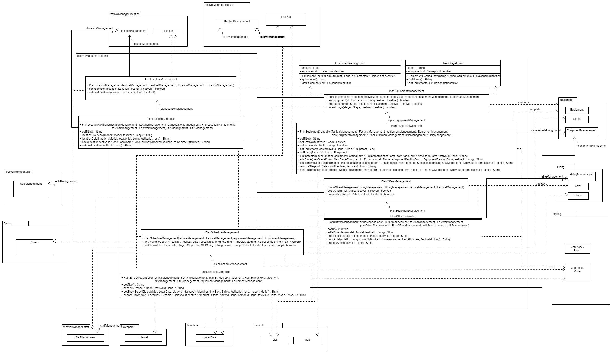
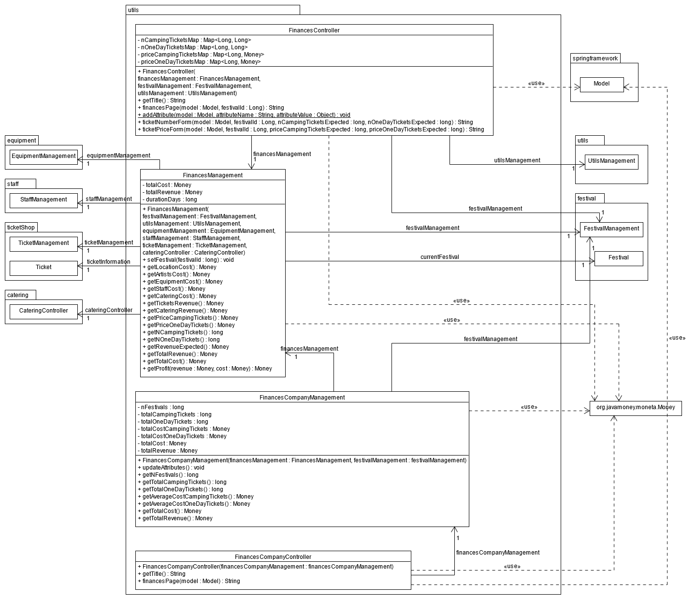
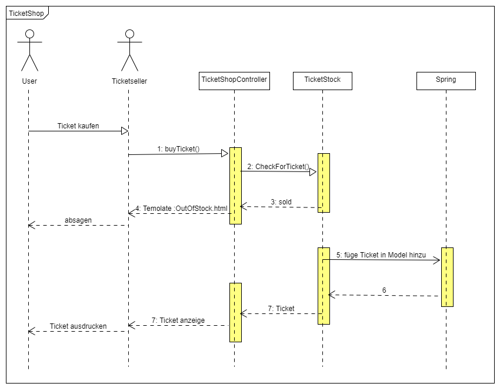

[options="header"]
[cols="1, 3, 3, 4"]
|===
|Version | Bearbeitungsdatum   | Autor | Vermerk
|1.0	| 14.11.2021 | Adrian, Robert, Georg, Jan |
|===

:numbered:

== Entwicklerdokumentation

== Einführung und Ziele
* Aufgabenstellung
	- Entwicklung eines Systems zum Management von Festivals
	- Features:
		** Planung von Festivals
			*** Ort, Datum
			*** Aufbau des Festivalgeländes
			*** Buchung des Personals
			*** Buchung benötigter Gegenstände (Bühnen, Toiletten)
		** Ticketsystem
			*** Erstellung eindeutiger/einzigartiger Tickets
			*** Verkauf -> Interface für das Verkaufspersonal
			*** Eingangskontrolle -> Interface für das Kontrollspersonal
		** Verkaufsinterface für Catering
			*** Bearbeitung des Lagerbestands
		** Internes Nachrichtensystem
			*** Personal kann Nachrichten an den Festivalleiter senden
		** Buchung von Künstlern
		** Management des Personals
		** Kostenaufstellung (Mieten, Gagen, Personal, ...)
		** Besucherterminals mit Lage- und Spielplan
* Qualitätsziele
	- Benutzerfreundlichkeit
	- einfache Wartung / Erweiterung -> Modularität
	- persistente Datenhaltung
	- stabile Webanwendung
	- Wiederverwendung bestehender Lösungen
	- Wiederverwendbarkeit
	- Fehlerfreiheit

== Randbedingungen
* Hardware-Vorgaben
	- Client:
		** muss eine Website anzeigen -> min. 4Gb RAM, 1-2 CPU Kerne
	- Server:
		** hostet eine Website -> RAM und CPU bedarf hängt von Anzahl und größe der Veranstaltungen ab
* Software-Vorgaben
	- Browserunterstützung:
		** Chrome ab version 92
		** Firefox ab version 85
	- Java-version: 16
* Vorgaben zum Betrieb der Software
    - der Server kann in einem CLI ausgeführt werden
    - der Client erfordert eine grafische Oberfläche mit Webbrowser

== Kontextabgrenzung

== Lösungsstrategie
=== Erfüllung der Qualitätsziele
[options="header"]
|===
|Qualitätsziel |Lösungsansatz
|persistente Datenhaltung |Verwendung der javax Entities
|stabile Webanwendung|Verwendung des Spring Frameworks
|Wiederverwendung bestehender Lösungen|Verwendung des SalesPoint
|Wiederverwendbarkeit|komplette Programmierung in OOP und Bausteinen
|Fehlerfreiheit|Testen mit dem jUnit
|===

=== Softwarearchitektur
image::models/analysis/TLA.png[]

=== Entwurfsentscheidungen
* Verwendete Muster
  - Wir verwenden das Model- View- Controller- Muster des Spring Frameworks.
  - Wir verwenden Observer bei dem Catering Stock.
  - Wir verwenden TemplateMethod bei den Areas.
  - Wir verwenden TemplateMethod für die Rollen beim Personal.
* Persistenz
  - Wir verwenden die Persistenz der javax- Entity Klassen.
* Benutzeroberfläche
  - Die Benutzeroberfläche ist eine HTML- Anwendung.
* Verwendung externer Frameworks

[options="header", cols="1,2"]
|===
|Externes Package |Verwendet von (Klasse der eigenen Anwendung)
|java.util a|
- Booking
- FestivalInitializer
- NewFestivalForm
- PlanDate

|org.salespointframework.catalog a|
- EquipmentCatalog

|org.salespointframework.core a|
- FinancesController
- LocationDataInitializer
- EquipmentDataInitializer

|org.springframework.data a|
- PurchasesRepository
- LocationManagement
- LocationRepository
- FestivalController
- FestivalManagement
- FestivalRepository
- EquipmentCatalog
- EquipmentRepository
- StaffRepository

|org.springframework.boot a| 
- Application

|org.springframework.validation a|
- FestivalController

|org.springframework.security a|
- FinancesController
- StaffController
- Application

|org.springframework.ui |Alle Controller

|org.javamoney.moneta.Money a|
- FinancesController
- FinancesManagement
- FinancesCompanyController
- FinancesCompanyManagement
- LocationDataInitializer
- Location
- Catering
- Artist

|javax.persistence a|
- Location
- Festival
- Equipment
- Person
- Show

|javax.validation a|
- CreateStaffForm
- RemoveStaffForm
|===

== Bausteinsicht

=== Festival

image::models/design/developer_documentation/class_diagrams/festival.png[]

[options="header"]
|===
|Klasse/Enumeration |Beschreibung
|Festival|Klasse, die Festivals als zentrale Objekte beschreibt
|FestivalManagement|Klasse, um Festival-Instanzen zu verwalten
|FestivalController|Spring MCV Controller, welcher Anfragen bezüglich Erstellung und Bearbeitung von Festivals verarbeitet
|FestivalRepository|Speicherortschnittstelle, um Festival-Instanzen zu speichern
|FestivalInitializer|Implementierung des DataInitializer, um Festivalvorlagen zu erstellen
|NewFestivalForm|Klasse, um Benutzereingabe bei der Festivalerstellung zu validieren
|StringInputForm|Klasse, um Benutzereingabe für Änderung des Festivalnamens zu validieren
|Schedule|Klasse, die den Programmablauf des Festivals auf den jeweiligen Bühnen beschreibt 
|TimeSlot|Enumeration, welche die 5 Timeslots beschreibt
|===

=== Location

[options="header"]
|===
|Klasse/Enumeration |Beschreibung
|Location|Klasse, die Locations als dem Festival hinzufügbare Objekte beschreibt
|LocationManagement|Klasse, um Location-Instanzen zu verwalten
|LocationController|Spring MVC Controller, welcher Anfragen bezüglich des anzeigens von Locations behandelt
|LocationRepository|Speicherortschnittstelle, um Location-Instanzen zu speichern
|LocationDataInitializer|Implementierung des Datainitializers, um bereitgestellte Locations zu erstellen
|Bookings|Klasse, die Buchungen beschreibt, die einer Location zugewiesen werden können
|===

=== Ticketshop

image::models/design/developer_documentation/class_diagrams/ticketShop.png[]

[options="header"]
|===
|Klasse/Enumeration |Beschreibung
|TicketShopController   |Ein Spring MVC Controller, um die Anfrage zu bearbeiten, Tickets zu verkaufen.
|Ticket |Klasse, die die neue Tickets für ein Festival beschreibt
|TicketStock|Klasse, um den Lagerbestand des Tickets anzuzeigen
|TicketService|Klasse, wo die Geschäftslogik-methode für ein Ticket implementiert
|enum |zeigt den Typ des Tickets an

|===

=== Staff

image::models/design/developer_documentation/class_diagrams/staff.png[]

[options="header"]
|===
|Klasse/Enumeration |Beschreibung
|Person |Basisklasse für das Personal, die alle gemeinsamen Eigenschaften enthält
|StaffRepository |Speicherschnittstelle um die Personendaten zu speichern
|StaffManagement |Klasse zur inteligenten Verwaltung des Repositories
|StaffController |Der Controller für das Webinterface zu verwaltung des Personals
|StaffDataInitializer |Klasse um Testdaten für das Package zu generieren
|UserIdControllerAdvice |Hilfsklasse für Spring um die userId als globales Model-Attribut zu setzten
|forms::CreateStaffForm |Klasse, die das Formular um Personen zu erstellen repräsentiert
|forms::RemoveStaffForm |Klasse, die das Formular um Personen aus dem Repository zu entfernen repräsentiert
|forms::ChangePasswordForm |Klasse, die das Formular für das ändern des Passworts repräsentiert
|forms::ChangeRoleForm |Klasse, die das Formular für das anpassen der Rolle repräsentiert
|===

=== Messaging

[options="header"]
|===
|Klasse/Enumeration |Beschreibung
|MessageType |Enum für den Typ der Nachricht: Persönlich / Grupper / Global
|Message |eine Nachricht im Nachrichtensystem
|MessageRepository |Speicherschnittstelle um die Nachrichten zu speichern
|MessageManagement |Klasse zur inteligenten Verwaltung des Repositories
|MessageController |Der Controller für das Webinterface zum einsehen und senden von Nachrichten
|MessageDataInitielizer |Klasse um Testdaten für das Package zu generieren
|forms::SendMessageForm |Basisklasse für die Formulare, die alle gemeinsamen Eigenschaften enthält
|forms::SendPersonalMessageForm |Formular um eine persönliche Nachricht zu senden
|forms::SendGroupMessageForm |Formular um eine Gruppennachricht zu senden
|forms::SendGlobalMessage |Formular um eine global Nachricht zu senden
|===

=== Catering

[options="header"]
|===
|Klasse/Enumeration |Beschreibung
|CateringSalesItem|Ein Verkauftes Produkt mit der Menge
|CateringSales|Alle verkauften Produkte aller Festivals
|CateringProduct|Instanz eines Produktes welches im Catering- Bereich verkauft wird.
|CateringProductCatalog|Alle Produkte die im System vorhanden sind.
|CateringStockItem|Ein Lagerbestand mit Produkt und Menge
|CateringStock|Instanz des Lagers eines Festivals.
|CateringStockController|Erlaubt es das Lager zu managen.
|CateringController|Erlaubt es Produkte zu verkaufen
|===

=== Planning

[options="header"]
|===
|Klasse/Enumeration |Beschreibung
|PlanLocationManagement|Klasse, um einem Festival eine Location zuzuweisen
|PlanLocationController|Spring MVC Controller, welcher Anfragen bezüglich des Planens von Locations für ein Festival behandelt
|PlanEquipmentManagement|Klasse, um einem Festival Gegenständen und Bühnen zuzuweisen
|EquipmentRentingForm|Klasse, um Benutzereingabe beim Mieten von Gegenständen zu validieren
|NewStageForm|Klasse, um Benutzereingabe bei der Miete von Bühnen zu validieren
|PlanEquipmentController|Spring MVC Controller, welcher Anfragen bezüglich des Planens von Gegenständen und Bühnen für ein Festival behandelt
|PlanOffersManagement|Klasse, um einem Festival Künstler zuzuweisen
|PlanOffersController|Spring MVC Controller, welcher Anfragen bezüglich des Planens von Künstlern für ein Festival behandelt
|PlanScheduleManagement|Klasse, um den Spielplan für ein Festival zu erstellen
|PlanScheduleController|Spring MVC Controller, welcher Anfragen bezüglich des Planens des Spielplanes für ein Festival behandelt
|===

=== Equipment

[options="header"]
|===
|Klasse/Enumeration |Beschreibung
|Equipment|Klasse, zeigt die Gegenständ, die in Festivals benutzt werden.
|Stage|Klasse, die Stageobjekte mit repräsentiert
|EquipmentRepository|Speicherortschnittstelle, um Equipment-Instanzen zu speichern
|StageRepository|Speicherortschnittstelle, um Stage-Instanzen zu speichern
|EquipmentDataInitializer|Implementierung des Datainitializers, um bereitgestellte Equipment zu erstellen
|EquipmentManagement|Klasse, um Equipment-Instanzen und Stage-Instanzen zu verwalten
|EquipmentType|Enumeration zur Beschreibung des Equipmenttypes
|===

=== Hiring

[options="header"]
|===
|Klasse/Enumeration |Beschreibung
|Artist|klasse von Artist.
|BookingArtist|Buchen für Artist, zeigt den Zeitraum, wann ein Artist gebucht ist.
|Show|klasse von Show, enhält ind Information von dem Show.
|HiringManagement|erlaubt hiring von artist zu managieren .
|ArtistDataInitializer|Implementierung des Datainitializers, um bereitgestellte Offers zu erstellen
|HiringController|Bildet die Schittstelle zwischen artists.html Datei, ihren TML-Forms um dem hiring package
|NewArtistForm|Um einen neuen Artist zu erstellen oder einen bereit existierten Artist zu aktualisieren
|NewShowForm|Um einen neuen Show zu erstellen
|ArtistRepository|wo alle Artists gespeichert sind
|===

=== Finances

[options="header"]
|===
|Klasse/Enumeration |Beschreibung
|FinancesController | Bildet die Schnittstelle zwischen der finances.html Datei, ihren HTML-Forms und dem finances package
|FinancesManagement | Berechnet die Finanzdaten für ein konkretes Festival
|FinancesCompanyController | Bildet die Schnittstelle zwischen der financesCompany.html Datei und dem finances package
|FinancesCompanyManagement | Berechnet die Finanzdaten für die gesamte FVIV GmbH
|===

=== Utils

|===
|Klasse/Enumeration |Beschreibung
|UtilsManagement| Um das Menü Korrekt darzustellen werden Informationen über das Festival im Model benötigt (z.B. Name, Location gebucht).
Diese werden per UtilsManagement zum Model hinzugefügt
|CustomErrorController| Der Controller für eine CustomErrorPage, die die Whitelabel Error Page ersetzt
|CustomExceptionController| Handelt exceptions und verwendet einen CustomErrorController um eine Fehlermeldung anzuzeigen
|===

=== Rückverfolgbarkeit zwischen Analyse- und Entwurfsmodell
_Die folgende Tabelle zeigt die Rückverfolgbarkeit zwischen Entwurfs- und Analysemodell. Falls eine Klasse aus einem externen Framework im Entwurfsmodell eine Klasse des Analysemodells ersetzt,
wird die Art der Verwendung dieser externen Klasse in der Spalte *Art der Verwendung* mithilfe der folgenden Begriffe definiert:_

* Inheritance/Interface-Implementation
* Class Attribute
* Method Parameter

[options="header"]
|===
|Klasse/Enumeration (Analysemodell) |Klasse/Enumeration (Entwurfsmodell) |Art der Verwendung
|Message |org.springframework.jms.core.JmsTemplate |Inheritance/Interface-Implementation
|Finances.income |org.springframework.data.repository |Class Attribute
|StaffToHire |org.springframework.data.repository |Class Attribute
|===

== Laufzeitsicht

=== Planung

image::models/design/developer_documentation/sequence_diagrams/planning.jpg[]

=== TicketShop
                 

=== Staff

=== Catering

===  Nachrichtensystem

===  Location

=== Finanzen

image::models/design/developer_documentation/sequence_diagrams/seq_finances.png[]

=== Festival

== Technische Schulden
* Auflistung der nicht erreichten Quality Gates und der zugehörigen SonarQube Issues zum Zeitpunkt der Abgabe
