= Pflichtenheft
:project_name: Festivalmanager
== __{project_name}__

[options="header"]
[cols="1, 1, 1, 1, 4"]
|===
|Version | Status      | Bearbeitungsdatum   | Autoren(en) |  Vermerk
|0.1     | In Arbeit   | 10.10.2021          | -       | Initiale Version
|0.2     | In Arbeit   | 26.10.2021          | Georg, Jan, Ahmad
       | -
|0.3     | In Arbeit   | 29.10.2021          | Georg, Jan, Ahmad
       | -
|1.0     | Großteils fertig   | 31.10.2021          | Georg, Jan, Ahmad
       | Robert muss seinen Prototyp noch ergänzen
|1.1     | Fertiges Pflichtenheft   | 05.11.2021          | Georg, Jan, Ahmad
       |
|===

== Inhaltsverzeichnis
- <<1, 1. Zusammenfassung>>
- <<2, 2. Aufgabenstellung und Zielsetzung>>
- <<3, 3. Produktnutzung>>
- <<4, 4. Interessensgruppen>>
- <<5, 5. Systemgrenze und Top-Level-Architektur>>
 * <<5_1, 5.1. Kontextdiagramm>>
 * <<5_2, 5.2. Top-Level-Architektur>>
- <<6, 6. Anwendungsfälle>>
 * <<6_1, 6.1. Akteure>>
 * <<6_2, 6.2. Überblick Anwendungsfalldiagramm>>
 * <<6_3, 6.3. Anwendungsfallbeschreibung>>
- <<7, 7. Funktionale Anforderungen>>
 * <<7_1, 7.1. Muss-Kriterien>>
 * <<7_2, 7.2. Kann-Kriterien>>
- <<8, 8. Nicht-Funktionale Anforderungen>>
 * <<8_1, 8.1. Qualitätsziele>>
 * <<8_2, 8.2. Konkrete Nicht-Funktionale Anforderungen>>
- <<9, 9. GUI Prototyp>>
 * <<9_1, 9.1. Überblick: Dialoglandkarte>>
 * <<9_2, 9.2. Dialogbeschreibung>>
- <<10, 10. Datenmodell>>
 * <<10_1, 10.1. Überblick: Klassendiagramm>>
 * <<10_2, 10.2. Klassen und Enumerationen>>
- <<11, 11. Akzeptanztestfälle>>
- <<12, 12. Glossar>>
- <<13, 13. Offene Punkte>>

[#1]
== Zusammenfassung
In diesem Dokument werden die wichtigsten Informationen zum Projekt sowohl 
für die Entwickler als auch für den Auftraggeber zusammengefasst.
Vor allem werden hier Anforderungen an das Produkt festgehalten, auf die 
sich Entwickler und Auftraggeber geeinigt haben. Einige Konkrete Ansätze für die
Implementation sind in den Abschnitten zum GUI Prototyp und Datenmodell zu finden.
Am Ende der Enticklung kann dieses Dokument verwendet werden, um zu prüfen, ob 
das Produkt den Anforderungen des Auftraggebers entspricht.

Ein besonders wichtiger Unterpunkt sind die Anwendungsfälle der Software,
die den Entwicklern als Grundlage für die GUI und das Klassendiagramm dienen.
Im Abschnitt zu funktionalen Anforderungen werden Muss- und Kann Kriterien zusammengetragen,
die der Festivalmanager am Ende der Entwicklung unbedingt erfüllen muss bzw. zusätzlich erfüllen kann.
Im Unterpunkt "Systemgrenze und TLA" werden noch Erkenntnisse aus der
Analysephase per UML visualisiert.

[#2]
== Aufgabenstellung und Zielsetzung
Der Festivalveranstalter, die „FVIV GmbH“, sieht sich mit ihrem derzeitigen System den wachsenden 
Aufgaben einer Festival-Organisation und –Durchführung nicht mehr gewachsen und benötigt daher 
zeitnah ein neues IT-System, das interne Verwaltungsaufgaben, als auch den Kundenkontakt 
übernimmt. Daher werden sie damit beauftragt, dieses System zu entwerfen und auch umzusetzen.

Das System soll unter anderem in der Planungsabteilung eingesetzt werden, in der Festivals angelegt 
werden.  Dazu  muss  ein  Termin  festgelegt  werden  und  die  passende  Location  zu  diesem  Zeitpunkt  
gebucht werden. Doppelbuchungen dieser Locations sind unter allen Umständen zu vermeiden. Jede 
Location  bietet  Platz  für  eine  maximale  Anzahl  von  Besuchern  und  Bühnen.  Außerdem  ist  jede  
Location  in  verschiedene,  eindeutig  gekennzeichnete  Bereiche  unterteilt,  die  wiederum  einen  Teil  
der  maximalen  Besucherzahl  fassen  können  und  sich  außerdem  in  Camping-,  Park-,  Catering-  und 
Stage-Bereiche  einordnen.  Um  dem  Planungsteam  einen  guten  Überblick  zu  verschaffen,  ist  es  
zwingend  notwendig,  dass  das  Gelände  und  die  Bereiche  visualisiert  werden  können.  Sobald  die  
Location gebucht ist, können für dieses Festival Anpassungen durchgeführt werden, wie die 
Bühnenpositionierung, Toilettenbestückung und Cateringstände, und es muss möglich sein, 
bestimmte  Bereiche  zu  sperren.  Die  genannten  Gegenstände  (Bühnen,  usw.)  werden  von  externen  
Anbietern gemietet.

In  der  nächsten  Stufe  muss  das  „Line-Up“  zusammengestellt  werden.  Dazu  müssen  Angebote  bei  
verschiedenen  Künstlern  eingeholt  werden.  Anschließend  werden  aus  diesen  Angeboten  Künstler  
ausgewählt  und  es  muss  ein  Spielplan  für  jede  Bühne  erstellt  werden.  Neben  den  genannten  
Künstlern  ist  weiteres  Personal  erforderlich,  wie  Sicherheitspersonal  (mindestens  einer  pro  100  
Besuchern),  Bedienungen  an  den  Cateringständen,  Bühnentechniker  (Anzahl  wird  durch  die  Band  
bestimmt), sowie ein Veranstaltungsleiter. Jede Arbeitskraft wird dabei auf Stundenbasis bezahlt.

Zu  jedem  Zeitpunkt  während  der  Planung  muss  der  Planungsabteilung  als  auch  dem  Management  
eine  automatische  Kostenaufstellung  zur  Verfügung  gestellt  werden  können,  in  der  Kosten  für  
Mieten, Gagen, Personal und Sonstigem aufgelistet und aggregiert werden.

Schon während der Planungsphase kann ein Event freigegeben werden, und es kann ein Kartenpreis 
festgelegt  werden.  Es  gibt  dabei  Camping-Tickets,  die  das  ganze  Festival  über  gültig  sind und  
Tageskarten.  Diese  Tickets  werden  bis  3  Tage  vor  Veranstaltungsbeginn  in  den  Filialen  der  „FVIV  
GmbH“ verkauft und danach nur noch an der Abendkasse. Es muss den Verkaufsmitarbeitern möglich 
sein, bei noch vorhandenen Tickets diese zu verkaufen und auszudrucken. Auf jedes Ticket wird ein 
Barcode  bzw.  eine  eindeutige  Nummer  aufgedruckt,  mit  dem  es  dem  Personal  am  Festivaleingang  
möglich  ist,  das  Ticket  auf  Gültigkeit  hin  zu  überprüfen  und  zu  vermeiden,  dass  verschiedene  
Personen das Gelände mit derselben Karte betreten. 

Eine  weitere  Nutzergruppe  ist  das  Cateringpersonal,  das  sich  an  entsprechenden  Terminals  am 
Verkaufsstand mit gültigem Login anmeldet. Dort können Getränke und vorgefertigte Speisen 
ausgewählt  und  abgerechnet  werden.  Dabei  wird  das  Gekaufte  vom  verfügbaren  Lagerbestand  
abgezogen. Sollte ein gewisser Mindestbestand unterschritten werden erfolgt eine Mittteilung an die 
Festivalleitung.

Der  Festivalleiter  besitzt  ebenfalls  ein  persönliches  Terminal,  an  dem  es  ihm  möglich  ist,  das  Lager  
einzusehen  und  Nachbestellungen  zu  tätigen.  Weiterhin  sieht  er  dort  aktuelle  Besucherzahlen,  
Nachrichten von anderen Mitarbeitern, sowie Verkaufszahlen des Caterings und die aktuelle 
Bühnenbelegung.

Überall auf dem Festivalgelände verteilt befinden sich Terminals, die für jeden frei nutzbar sind. Dort 
sieht man neben einem Plan vom Festivalgelände auch den Spielplan für alle Festivaltage.

Der Manager der „FVIV GmbH“ sorgt für die Verteilung der Logins an die Mitarbeiter und kann sehen, 
welcher  Mitarbeiter  momentan  am  System  angemeldet  ist.  Weiterhin  soll  es  ihm  möglich  sein, 
betriebswirtschaftliche Daten, wie Umsatz, Ausgaben,... , abzurufen und grafisch zu visualisieren

Zum Abschluss des Projekts ist unser oberste Ziel natürlich, alle obigen Anforderungen zu erfüllen.

Dabei ist es wichtig, dass das Programm eine intuitive Benutzeroberfläche hat und ohne langer 
Einarbeitunszeit benutzt werden kann.
Wir wollen außerdem stabile Software bauen, welche nicht bspw. das Cateringpersonal 
bei einer invaliden Eingabe durch einen Absturz ausbremst.
Unsere Software sollte für die Organisation von 10 Festivals pro Jahr genauso gut wie 
für die Organisation von 100 Festivals pro Jahr geeignet sein,
um Wachstum der „FVIV GmbH“ nicht zu behindern.

Der Programmcode des Festivalmanagers sollte so geschrieben werden, dass er bei zukünftigen
Projekten teilweise wiederverwendet werden kann.
Unser Code sollte leicht instandzuhalten und zu erweitern sein.
Beim Abschluss des Projekts sollte unser Code also gut lesbar sein, 
wenig Codeverschmutzung aufweisen und gründlich dokumentiert sein.

[#3]
== Produktnutzung
Das System soll über ein Interface (u.a. auf der Festivalgeländer verteilte Terminals) genutzt werden.
Dies wird durch eine Website realisiert. Die Software ist deshalb ein Webserver, der nur im LAN des Festivals ereichbar ist.
Außerdem soll die FVIV - Gmbh in der Lage sein Festivals zu planen und vor Festival-start den Festival-Server zu konfigurieren.

Die Hauptnutzer der Software wird das Festival-Personal sein, das verschiedene Management- und Verkaufsaktionen über das Interface ausführen wird.
Diese Nutzergruppe wird keinen Technischen Hintergrund haben, weshalb die Software sehr Benutzerfreundlich sein muss.

Außerdem können die Terminals auch von den Festival-Besuchern genutzt werden, um Lage- und Spielplan einzusehen.

Unterstützte Browserversionen:
[]
- Chrome: 92.0
- Firefox: 85.0
- (Safari: 15.0)

[#4]
== Interessensgruppen (Stakeholders)
[options="header"]
[cols="1, 1, 1, 1"]
|===
|Name |Priorität (1-5) |Beschreibung |Ziele
|Manager der „FVIV GmbH“ | 5 | Auftragsgeber für dieses Projekt a| - Größerer Umsatz für das Unternehmen
durch effizienteres Festivalmanagement

|Planungsabteilung | 4 |Plant Festivals (Ort und Zeit) a| - Einfache Planung von Festivals
- Verhinderung von Doppelbuchungen

a|Festival Personal:

- Catering
- Ticketverkauf
- Einlass
- Sicherheit
- Bühnentechniker| 4 |Hauptnutzer der Software, können während des Festivals verschiedene Management aktivitäten über Terminals erledigen a| - Benutzerfreundliche Oberfläche
- Sicherheit: jede Personal-gruppe kann nur auf ihr eigenes Interface zugreifen

|Veranstaltungsleiter / Festivalleiter / Chef | 4 |Hauptnutzer der Software, kann während des Festivals auf Informationen des Personals zugreifen und ggf. notwendige Management Aktionen ausführen (z.b. Zutaten für das Catering nachbestellen) a| - Benutzerfreundliche Oberfläche

|Besucher | 1 |Festival Besucher, die über Terminals den Lageplan und die Spielpläne der Bühnen einsehen können a| - Benutzerfreundliche Oberfläche
- Sicherheit: Besucher können nicht auf die Interfaces des Personals zugreifen

|Entwickler | 4 |Entwickler, die diese Software entwickeln oder später warten müssen a| - Einfache erweiterung des Systems
- Geringe Wartungsarbeiten an dem System
- Gute Debugging möglichkeiten
|===

[#5]
== Systemgrenze und Top-Level-Architektur

[#5_1]
=== Kontextdiagramm
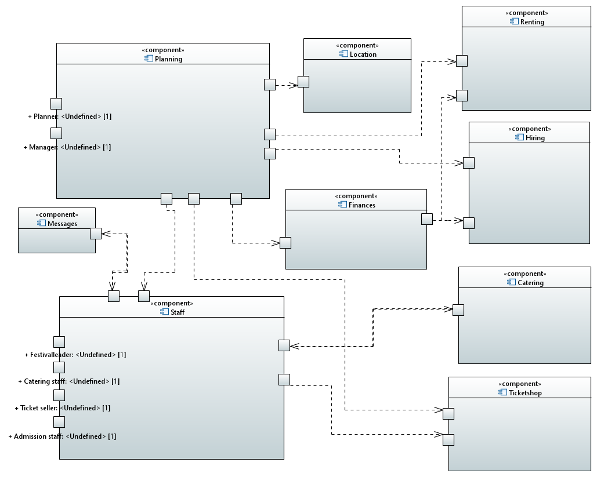

[#5_2]
=== Top-Level-Architektur
image::models/analysis/requirements_specification/TLA.png[]

[#6]
== Anwendungsfälle

[#6_1]
=== Akteure
[options="header"]
[cols="1,4"]
|===
|Name |Beschreibung
|Besucher |Ein Festivalbesucher, kann Terminals nutzen um den Lageplan und Zeitplan abzurufen
|Personal |Personal des Festivals
|Catering-Personal |Verkäufer von Speisen und Getränken, kann den Festivalleiter über geringe Lagerbestände informieren
|Security-Personal |sorgt für Sicherheit auf dem Gelände
|Einlass-Personal |kontrolliert Tickets am Eingang
|Festivalleiter |kann Lager überprüfen und Nachbestellung tätigen, empfängt Nachrichten vom Personal
|Planer |Plant das Festival
|Ticket-Verkäufer |kann ein valides Ticket generieren und ausdrucken
|Manager der „FVIV GmbH“ |kann Accounts der Mitarbeiter kontrollieren und sich
betriebswirtschaftliche Informationen über das Unternehmen anzeigen lassen
|===

[#6_2]
=== Überblick Anwendungsfalldiagramm
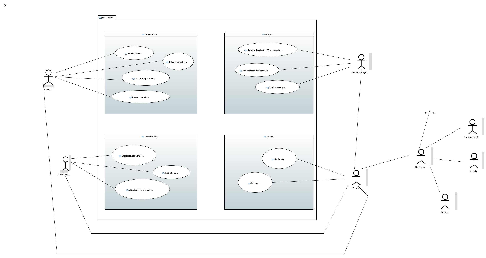
Anwendungsfall-Diagramm, das alle Anwendungsfälle und alle Akteure darstellt

[#6_3]
=== Anwendungsfallbeschreibungen
[cols="1h, 3"]
[[AF001]]
|===
|ID                          |**<<AF001>>**
|Name                        |Ticketverkauf
|Beschreibung                |bis 3 Tage vor Eventbegin sollen Tickets gekauft werden können. Dabei wird in Camping und Tagestickets unterschieden. Alle Tickets haben eine eindeutige Nummer, die für die Eingangskontrolle verwendet wird
|Akteure                     |Ticket-Verkäufer, Besucher
|Auslöser                    |Ein Besucher möchte ein Ticket kaufen
|Voraussetzung(en)           a|
1. Es sind noch Tickets vorhanden
2. Das Ticket wird mindestens 3 Tage  vor Event begin verkauft
|Essentielle Schritte        a|
1. Auswahl zwischen Camping und Tagesticket
2. Generierung einer eindeutigen Nummer für das Ticket
3. Abfrage des Ticketpreises (abhängig vom Ticket-Typ und Event)
4. Verkauf des Tickets (Verkäufer verlang Geld)
|Erweiterungen               |
|Funktionale Anforderungen   |<<F0001>>
|===
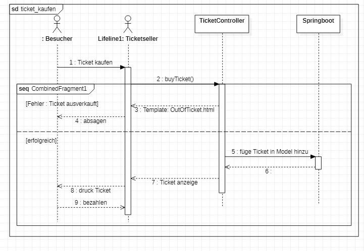

[cols="1h, 3"]
[[AF002]]
|===
|ID                          |**<<AF002>>**
|Name                        |Abendkasse-Ticketverkauf
|Beschreibung                |Ab 3 Tagen vor Eventbegin sollen Tickets an der Abendkasse gekauft werden können. Dabei wird in Camping und Tagestickets unterschieden. Alle Tickets haben eine eindeutige Nummer, die für die Eingangskontrolle verwendet wird.
|Akteure                     |Ticket-Verkäufer, Besucher
|Auslöser                    |Ein Besucher möchte ein Ticket kaufen
|Voraussetzung(en)           a|
1. Es sind noch Tickets vorhanden
2. Das Ticket wird ab 3 Tagen  vor Event begin verkauft
|Essentielle Schritte        a|
1. Auswahl zwischen Camping und Tagesticket
2. Generierung einer eindeutigen Nummer für das Ticket
3. Abfrage des Ticketpreises (abhängig vom Ticket-Typ und Event)
4. Verkauf des Tickets (Verkäufer verlang Geld)
|Erweiterungen               |
|Funktionale Anforderungen   |<<F0001>>
|===

[cols="1h, 3"]
[[AF003]]
|===
|ID                          |**<<AF003>>**
|Name                        |Eingangskontrolle
|Beschreibung                |Am Eingang zu der Location, auf der Ein Event stattfindet werden die Tickets der Besucher kontrolliert
|Akteure                     |Sicherheits-Personal, Besucher
|Auslöser                    |Ein Besucher möchte das Festival-Gelände betreten
|Voraussetzung               |Es läuft gerade ein Festival an dieser Location
|Essentielle Schritte        a|
1. Ablesen der Ticketnummer
2. Abfrage ob die Ticketnummer für dieses Event gültig ist
3. Ticketnummer für alle weiteren abfragen als ungültig markieren um doppeltes einchecken mit dem selben Ticket zu vermeiden
|Erweiterungen               |
|Funktionale Anforderungen   |<<F0001>>
|===

[cols="1h, 3"]
[[AF004]]
|===
|ID                          |**<<AF004>>**
|Name                        |Nachrichten senden
|Beschreibung                |Die Mitarbeiter können dem Festivalleiter Nachrichten senden
|Akteure                     |Festivalleiter, Catering-Personal, Einlass-Personal
|Auslöser                    |
_Nachricht senden_: Ein Mitarbeiter möchte mit dem Festivalleiter kommunizieren

_Nachricht empfangen_: Der Festivalleiter möchte prüfen, ob er
ungelesene Nachrichte hat
|Voraussetzung(en)           a|
_Nachricht senden_: Ein Mitarbeiter ist eingeloggt

_Nachricht empfangen_: Der Festivalleiter ist eingeloggt
|Essentielle Schritte        a|
_Nachricht senden_: 

1. Ein Mitarbeiter wählt den Menüpunkt "Nachrichten" aus

2. Der Mitarbeiter schreibt seine Nachricht

3. Der Mitarbeiter klickt "Abschicken"

_Nachricht empfangen_:

1. Der Festivalleiter wählt den Menüpunkt "Nachrichten" aus

2. Falls es ungelesenen Nachrichten gibt, kann er diese lesen
|Erweiterungen               |
|Funktionale Anforderungen   |<<F0001>>
|===

[cols="1h, 3"]
[[AF005]]
|===
|ID                          |**<<AF005>>**
|Name                        |Catering: Verkauf von Getränken und Speisen
|Beschreibung                |Besucher könnene an einem Verkaufsstand Speisen und Getränke kaufen
|Akteure                     |Besucher, Catering-Personal
|Auslöser                    |Ein Besucher möchte etwas an einem Verkaufsstand kaufen
|Voraussetzung               |Das gewünschte Getränk/Essen ist noch auf Lager
|Essentielle Schritte        a|
1. Entnahme der zutaten aus dem Lager
2. evtl. Mitteilung an Festival-Leitung, wenn die Zutaten in zu geringen Mengen gelagert sind
3. Zubereitung der Bestellung
4. Verkauf
|Erweiterungen               |
|Funktionale Anforderungen   |<<F0001>>
|===

[cols="1h, 3"]
[[AF006]]
|===
|ID                          |**<<AF006>>**
|Name                        |Lager einsehen & Nachbestellung von Speisen und Getränken
|Beschreibung                |Der Festivalleiter kann den Lagerbestand prüfen und gegebenfalls neue Waren bestellen
|Akteure                     |Festivalleiter
|Auslöser                    |Der Festivalleiter möchte den Lagerbestand prüfen oder etwas nachbestellen
|Voraussetzung               |Der Festivalleiter ist am entsprechenden Terminal angemeldet
|Essentielle Schritte        a|
1. Abrufen des Lagerbestandes
2. evtl. Nachbestellung einer oder mehrerer Waren in beliebigen Mengen
|Erweiterungen               |
|Funktionale Anforderungen   |<<F0001>>
|===

[cols="1h, 3"]
[[AF007]]
|===
|ID                          |**<<AF007>>**
|Name                        |Festivalleiter Status Abbruf
|Beschreibung                |Der Festivalleiter kann verschiedene Informationen über das Event an einem Terminal jederzeit abrufen
|Akteure                     |Festivalleiter
|Auslöser                    |Der Festivalleiter möchte Informationen über das Event
|Voraussetzung               |Der Festivalleiter ist am entsprechenden Terminal angemeldet
|Essentielle Schritte        |Abrufen der Informationen(Verkaufszahlen, Bühnenbelegung,...) an dem Terminal
|Erweiterungen               |
|Funktionale Anforderungen   |<<F0001>>
|===
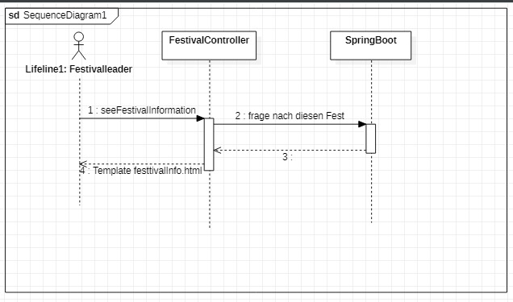

[cols="1h, 3"]
[[AF008]]
|===
|ID                         |**<<AF008>>**
|Name                       |Terminal für Festivalbesucher
|Beschreibung               |Festivalbesucher sollen sich am Terminal über Lageplan und Spielplan informieren können.
|Akteure                     |Festivalbesucher
|Auslöser                    |
_Öffnen des Festivalmanagers_: Wenn sich noch kein Mitarbeiter angemeldet hat werden Informationen zum Festival gezeigt

_Mitarbeiterlogout_: Wenn kein Mitarbeiter angemeldet ist werden Informationen zum Festival angezeigt
|Voraussetzung(en)           a|Es ist kein Nutzer angemeldet
|Essentielle Schritte           a|
1. Besuchermodus wird durch starten des Programms oder Logout eines Mitarbeiters aktiviert

2. Besucher kann Informationen über das Festival einsehen
|Erweiterungen                 |-
|Funktionale Anforderungen    |<<F0001>>
|===

[cols="1h, 3"]
[[AF009]]
|===
|ID                         |**<<AF009>>**
|Name                       |Line-Up planen
|Beschreibung               |Im Festivalmanager können Bands für bestimmte Bühnen und Zeiten gebucht werden
|Akteure                     |Festivalleiter, Planungsabteilung
|Auslöser                    |
Ein Nutzer öffnet den "Personal und Künstler" Tab
|Voraussetzung(en)           a|Ein Planer ist eingeloggt
|Essentielle Schritte           a|
1. Der "Personal und Künstler" Tab wird aufgerufen

2. Von einer Liste von Künstlern können Angebote eingeholt werden

3. Aus den erhaltenen Angeboten können verschiedene Künstler ausgewählt werden,
denen anschließend eine Bühne und Zeit zugewiesen wird
|Erweiterungen                 |-
|Funktionale Anforderungen    |<<F0001>>
|===

[cols="1h, 3"]
[[AF010]]
|===
|ID                         |**<<AF010>>**
|Name                       |Lageplan anpassen
|Beschreibung               |Im Festivalmanger kann eine Location für das Festival ausgewählt werden, auf dem Lageplan dieser Location können die Positionen von Bühnen, Catering, etc. angepasst werden
|Akteure                     |Festivalleiter, Planungsabteilung
|Auslöser                    |
Ein Nutzer öffnet den "Lageplan" Tab
|Voraussetzung(en)           a|
1. Ein Planer ist eingeloggt

2. Das gewählte Festival hat noch nicht begonnen.
|Essentielle Schritte           a|
1. Location aus einer Liste buchen, falls noch nicht gebucht wurde

2. Per Rechstklick auf Flächen im Lageplan auswählen, wofür diese Flächen genutzt werden (Bühne, Toilette, Catering, gesperrt)
|Erweiterungen                 |Location wechseln
|Funktionale Anforderungen    |<<F0001>>
|===
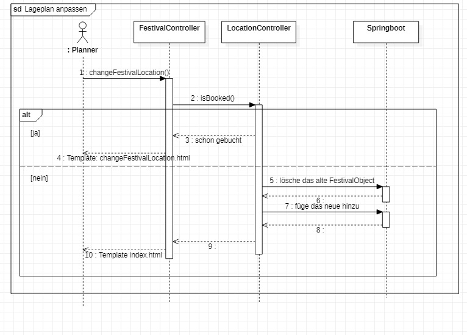

[cols="1h, 3"]
[[AF011]]
|===
|ID                          |**<<AF011>>**
|Name                        |Personal planen
|Beschreibung                |Das Planungsteam kann festlegen, wie viele Mitarbeiter für Security, Catering usw.
eingestellt werden müssen
|Akteure                     |Planer
|Auslöser                    |Ein Planer möchte das Personal für das Festival anpassen
|Voraussetzung(en)           a|Ein Planer ist eingeloggt
|Essentielle Schritte        a|
1. Ein Planer öffnet den "Personal" Tab

2. Er passt die Anzahl der Mitarbeiter in einem der Bereiche an

3. Wurde die Anzahl der Security Mitarbeiter angepasst, so wird überprüft,
ob die Anzahl den Vorgaben entspricht
|Erweiterungen               |
|Funktionale Anforderungen   |<<F0001>>
|===

[cols="1h, 3"]
[[AF012]]
|===
|ID                          |**<<AF012>>**
|Name                        |Finanzübersicht
|Beschreibung                |Das Planungsteam kann sich anzeigen lassen welche Kosten das geplante Personal,
Equipment usw. verursachen
|Akteure                     |Planer
|Auslöser                    |Ein Planer möchte die Kosten des Festivals einsehen
|Voraussetzung(en)           a|Ein Planer ist eingeloggt
|Essentielle Schritte        a|
1. Ein Planer öffnet den "Kosten" Tab

2. Er prüft wie viele Karten verkauft werden müssen,
um die Kosten des Festivals zu decken
|Erweiterungen               |
|Funktionale Anforderungen   |<<F0001>>
|===

[cols="1h, 3"]
[[AF013]]
|===
|ID                          |**<<AF013>>**
|Name                        |Login / Logout
|Beschreibung                |Das Personal muss sich anmelden um auf Programmfunktionen zuzugreifen, die
zu einer bestimmten Rolle gehören
|Akteure                     |Planer, Festivalleiter, Catering-Personal, Einlass-Personal, Ticket-Verkäufer
|Auslöser                    |
_Login_: Ein Mitarbeiter möchte auf die Programmfunktionen für seine Rolle zugreifen

_Logout_: Ein Mitarbeiter möchte sich abmelden
|Voraussetzung(en)           a|
_Login_: Es ist kein Nutzer eingeloggt

_Logout_: Ein Nutzer ist eingeloggt
|Essentielle Schritte        a|
_Login_:

1. Ein Nutzer klickt den "Login" Button

2. Er gibt seine Nutzerdaten ein

3. Wurden valide Nutzerdaten eingegeben, so können Funktionen
der Software entsprechend der Rolle des Nutzers verwendet werden

_Logout_:

1. Ein Nutzer klickt den "Logout" Button

2. Das Programm geht in den Besuchermodus
|Erweiterungen               |
|Funktionale Anforderungen   |<<F0001>>
|===
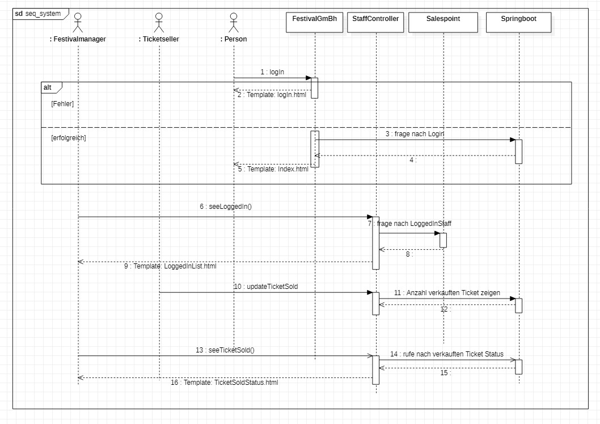

[cols="1h, 3"]
[[AF014]]
|===
|ID                          |**<<AF014>>**
|Name                        |Kartenpreis festlegen
|Beschreibung                |Das Planungsteam kann Preise für die verschiedenen Ticketklassen
entsprechend der Kosten des Festivals setzen
|Akteure                     |Planer
|Auslöser                    |Ein Planer möchte den Ticketpreis anpassen
|Voraussetzung(en)           a|
Das Festival hat noch nicht begonnen

Ein Planer ist eingeloggt
|Essentielle Schritte        a|
1. Ein Planer öffnet den "Kosten" Tab

2. Er passt den Preis für eine der Ticketklassen an

3. Der Planer überprüft ob bei diesem Preis die Kosten des Festivals gedeckt werden.
|Erweiterungen               |
|Funktionale Anforderungen   |<<F0001>>
|===

[cols="1h, 3"]
[[AF015]]
|===
|ID                          |**<<AF015>>**
|Name                        |Ticket ausdrucken
|Beschreibung                |Tickets die in Filialen gekauft wurden werden dort ausgedruckt
|Akteure                     |Ticket-Verkäufer
|Auslöser                    |In einer Fililale wird ein Ticket gekauft
|Voraussetzung(en)           a|Ein Ticket-Verkäufer ist eingeloggt
|Essentielle Schritte        a|
1. In einer Filiale wird ein Ticket gekauft, falls noch Tickets verfügbar sind

2. Das Ticket wird für den Käufer ausgedruckt
|Erweiterungen               |
|Funktionale Anforderungen   |<<F0001>>
|===

[cols="1h, 3"]
[[AF016]]
|===
|ID                          |**<<AF016>>**
|Name                        |Festival hinzufügen
|Beschreibung                |Ein weiteres Festival zu der Liste der aktuell zu planenden Festivals hinzufügen
|Akteure                     |Planer
|Auslöser                    |Ein Planer möchte mit der Planung für ein weiteres Festival beginnen
|Voraussetzung(en)           a|Ein Planer ist eingeloggt
|Essentielle Schritte        a|
|Erweiterungen               |
1. Ein Planer klickt "Festival Hinzufügen"

2. Er gibt grundlegende Informationen wie Name und Zeitraum des Festivals an
|Funktionale Anforderungen   |<<F0001>>
|===
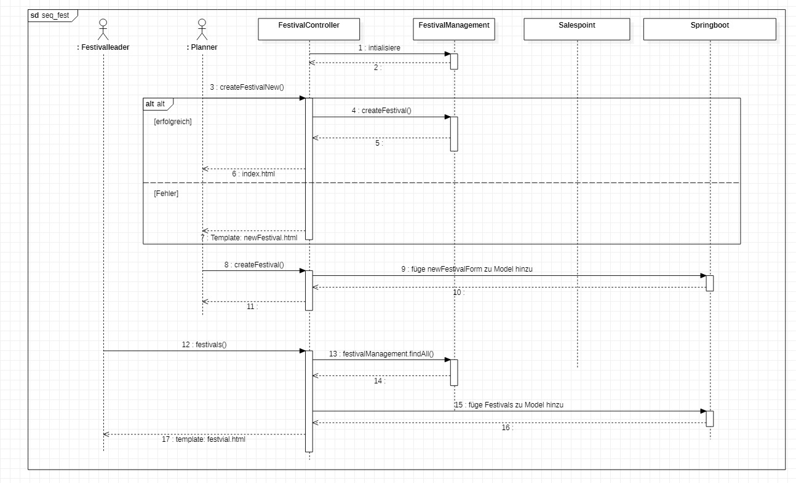

[cols="1h, 3"]
[[AF017]]
|===
|ID                          |**<<AF017>>**
|Name                        |Übersicht für Manager
|Beschreibung                |Der Manager kann Mitarbeitern einen Account zuweisen und Informationen über
Mitarbeiter und Finanzen des Unternehmens einsehen
|Akteure                     |Manager der „FVIV GmbH“
|Auslöser                    |Der Manager möchte Informationen über das Unternehmen einsehen
|Voraussetzung(en)           a|Der Manager ist eingeloggt
|Essentielle Schritte        a|
1. Der Manager meldet sich im System an

2. Er erstellt einen neuen Mitarbeiteraccount oder prüft
welche Mitarbeiter angemeldet sind oder lässt sich Informationen und Visualisierungen zu
Umsatz, Ausgaben,... anzeigen
|Erweiterungen               |
|Funktionale Anforderungen   |<<F0001>>
|===
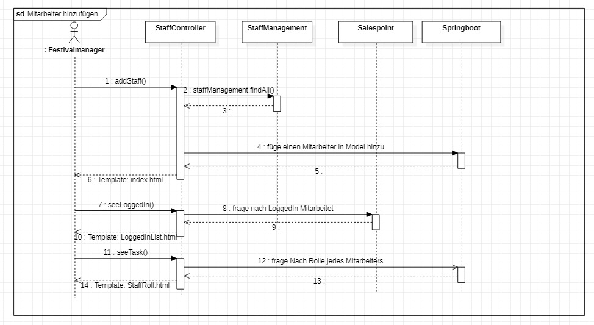

[#7]
== Funktionale Anforderungen

[#7_1]
=== Muss-Kriterien
[options="header", cols="4h, 1, 2, 15"]
|===
|ID
|Version
|Name
|Beschreibung

|[[F00001]]<<F00001>>
|v0.1
|Authentifizierung
a|
Das System muss in öffentlich zugängliche Teile und in Teile, die
für den Zugriff eine Authentifizierung erfordern, zerlegt werden
können. Wenn ein Benutzer im System vorhanden ist, muss er in
der Lage sein, sich zu authentifizieren, indem er die folgenden
Informationen angibt:

- Benutzername
- Passwort

|[[F00002]]<<F00002>>
|v0.1
|Registrierung
a|
Das System muss einem nicht authentifizierten Benutzer
(<<F00001>>) die Möglichkeit bieten, sich nach dem Aufruf des
Navigationselements namens "Registrieren" zu registrieren

Die folgenden Informationen müssen angegeben werden:

- Benutzername (eindeutig)
- Passwort
- Email-Adresse

Das System muss die bereitgestellten Daten validieren (<<F00003>>).
Der Benutzer muss im System als Kunde registriert sein und
muss sich nach erfolgreicher Validierung authentifizieren
(<<F00001>>) können.

|[[F00003]]<<F00003>>
|v0.1
|Registrierung validieren
a|
Das System muss in der Lage sein, die bereitgestellten Daten
eines nichtregistrierten Benutzers zu validieren.
Die Eindeutigkeit des Benutzernamens muss gewährleistet sein.
Der Benutzer muss über jede Verletzung der Einschränkungen
informiert werden.

|[[F00004]]<<F00004>>
|v0.1
|Katalog
a|
Das System muss in der Lage sein, einen schreibgeschützten
Zugriff auf vorhandene Gelände und Bereiche über einen Katalog zu
ermöglichen.

|[[F00005]]<<F00005>>
|v0.1
|Katalog ansehen
a|
Das System muss einem Benutzer die Möglichkeit bieten, den
Inhalt des Katalogs einzusehen.

|[[F00006]]<<F00006>>
|v0.1
| Bestellung in den Warenkorb legen
a|
Das System muss einem Benutzer die Möglichkeit bieten, ein
ausgefülltes Formular zur Bestellung dem Warenkorb hinzuzufügen.

|[[F00007]]<<F00007>>
|v0.1
|Warenkorb
a|
Das System muss jedem registrierten und authentifizierten
Benutzer einen Warenkorb zur Verfügung stellen, in dem er
ausgewählte Produkte zwischenspeichern kann. Der Warenkorb
muss temporär beständig und für jeden Benutzer einzigartig
sein.

|[[F00008]]<<F00008>>
|v0.1
|Warenkorb ansehen
a|
Das System muss einem Benutzer die Möglichkeit bieten, den
Inhalt des Warenkorbs zu authentifizieren.
Der Warenkorb muss folgende Angaben enthalten:

- Datum
- Eingefüllte Daten eines Festivals

|[[F00009]]<<F00009>>
|v0.1
| Im Warenkorb kaufen
a|
Das System muss einem Benutzer die Möglichkeit bieten, mit den
Bestellungen im Warenkorb zur Kasse zu gehen und diese zu bezahlen.

|[[F00010]]<<F00010>>
|v0.1
|Aufträge
a|
Das System muss in der Lage sein, Bestelldaten  dauerhaft zu speichern.

|[[F00011]]<<F00011>>
|v0.1
|Bestellung anlegen
a|
Das System muss in der Lage sein, eine Bestellung aus dem Inhalt
eines Warenkorbs zu erstellen.

Ein Auftrag muss mit dem Status "OFFEN" initialisiert werden.

|[[F00012]]<<F00012>>
|v0.1
|Bestellung bezahlen
a|

|[[F00013]]<<F00013>>
|v0.1
| Bestellung archivieren
a|

Das System muss in der Lage sein, einen Auftrag zu archivieren.
Ein Auftrag wird archiviert, indem sein Status auf
"ABGESCHLOSSEN" gesetzt wird

|[[F00014]]<<F00014>>
|v0.1
|Bestellung anzeigen
a|

as System muss einem Admin die Funktionalität zur Verfügung
stellen, alle Aufträge mit dem Status "ABGESCHLOSSEN"
einzusehen.
Die folgenden Informationen werden für jeden Auftrag
angezeigt:

- Zeitstempel der Erstellung
- Kunde, der den Auftrag erteilt hat
- Bezahlter Gesamtpreis der Bestellung

|[[F00015]]<<F00015>>
|v0.1
| Profil bearbeiten
a|
Das System muss einem Benutzer die Möglichkeit bieten, sein Profil zu bearbeiten.

|[[F00016]]<<F00016>>
|v0.1
| Termine buchen
a|

Das System muss einem Planer die Möglichkeit bieten, Termine festzulegen und
die passende Location zu diesem Zeitpunkt zu buchen.

|[[F00017]]<<F00017>>
|v0.1
| Standortaufteilung
a|

Das System muss einem Planer die Funktionalität zur Verfügung
stellen, die  Location in verschiedene,
eindeutig gekennzeichnete Bereiche unterteilt(<<F00018>>).

|[[F00018]]<<F00018>>
|v0.1
| Kapazitätsbegrenzung
a|

Das System muss einem Planer  die Funktionalität zur Verfügung
stellen,   die  maximale Besucherzahl für einen Bereich der
Location zu ermitteln  und sich außerdem in
Camping-, Park-, Catering- und Stage-Bereiche einordnen

|[[F00019]]<<F00019>>
|v0.1
| Datenvisualisierung
a|
Das System muss in der Lage sein, das Gelände und die Bereiche zu visualisieren.

|[[F00020]]<<F00020>>
|v0.1
| Änderungen vornehmen
a|
Das System muss einem Planer  die Funktionalität zur Verfügung
stellen, nachdem Location gebucht ist, können für dieses Festival Anpassungen durchgeführt werden, wie die
Bühnenpositionierung, Toilettenbestückung und Cateringstände.

|[[F00021]]<<F00021>>
|v0.1
| Ausrüstung mieten
a|
Das System muss einem Planer die Funktionalität zur Verfügung stellen,
Bühnen, Toilettenbestückung und Cateringstände von externen Anbietern zu mieten.

|[[F00022]]<<F00022>>
|v0.1
| Organisation
a|
Das System muss einem Planer die Möglichkeit bieten,  Angebote bei
verschiedenen Künstlern einzuholen, aus diesen Angeboten Künstler
auszuwählen, ein Spielplan für jede Bühne erstellt und Kartenpreis festzulegen.

|[[F00023]]<<F00023>>
|v0.1
| Kostenaufstellung
a|
Das System muss in der Lage sein, eine automatische Kostenaufstellung
(Kosten für  Mieten, Gagen, Personal und Sonstigem)zur Verfügung zu erstellen.

|[[F00024]]<<F00024>>
|v0.1
|Überblick
a|

Das System muss einem Admin die Übersicht bieten, welcher Mitarbeiter momentan am System angemeldet ist

|[[F00025]]<<F00025>>
|v0.1
| Geschäftsdaten
a|
Das System muss einem Admin die Möglichkeit geben,
betriebswirtschaftliche Daten, wie Umsatz, Ausgaben,... , abzurufen und grafisch zu visualiseren.

|===

[#7_2]
=== Kann-Kriterien
[options="header", cols="4h, 1, 2, 15"]
|===

|ID
|Version
|Name
|Beschreibung

|[[F00026]]<<F00026>>
|v0.1
| Katalog filtern
a|
Das System sollte die Funktionalität bieten, den Katalog zu filtern
(z.B. nach Verfügbarkeit oder Datum).

|[[F00027]]<<F00027>>
|v0.1
|Warenkorb bearbeiten
a|
Das System sollte die Funktionalität bieten, den Warenkorb
ändern zu können.

Dies beinhaltet:

- Entfernen einzelner Produkte
- Änderung eines ausgefüllten Tippscheins

|===

[#8]
== Nicht-Funktionale Anforderungen
Dieser Abschnitt wird einen Überblick über die nicht-funktionalen (NF) Anforderungen des
Projekts Festival Manager geben. Diese Anforderungen beschreiben, wie das System funktioniert und
innerhalb welcher Grenzen es funktionieren soll.

[#8_1]
=== Qualitätsziele

Die folgende Tabelle zeigt, welche Qualitätsanforderungen in welchem Umfang erfüllt werden
müssen. In der ersten Spalte sind die Qualitätsanforderungen aufgelistet, während in den
folgenden Spalten ein "x" zur Kennzeichnung der Priorität verwendet wird.

1 = Nicht wichtig .. 5 = Sehr wichtig

[options="header", cols="3h, ^1, ^1, ^1, ^1, ^1"]
|===
|Qualitätsanforderung           | 1 | 2 | 3 | 4 | 5
|Instandhaltbarkeit             |   |   | x |  |
|Benutzerfreundlichkeit         |   |   |   | x  |
|Benutzeroberfläche             |   |   |   |   | x
|Sicherheit                     |   |   |   |x  |
|===

[#8_2]
=== Konkrete Nicht-Funktionale Anforderungen
[options="header", cols="4h, 1, 2, 15"]
|===

|ID
|Version
|Name
|Beschreibung

|
|v0.1
| Verfügbarkeit-Laufzeit
a|as System muss mindestens 99,5% Laufzeit erreichen.

|
|v0.1
| Sicherheit - Passwort Speicherung
a| Passwörter von Benutzern dürfen nur als Hash-Werte
gespeichert werden, um Diebstahl zu verhindern.

|===

[#9]
== GUI Prototyp

In diesem Kapitel soll ein Entwurf der Navigationsmöglichkeiten und Dialoge des Systems erstellt werden.
Idealerweise entsteht auch ein grafischer Prototyp, welcher dem Kunden zeigt, wie sein System visuell umgesetzt werden soll.
Konkrete Absprachen - beispielsweise ob der grafische Prototyp oder die Dialoglandkarte höhere Priorität hat - sind mit dem Kunden zu treffen.

[#9_1]
=== Überblick: Dialoglandkarte
Erstellen Sie ein Übersichtsdiagramm, das das Zusammenspiel Ihrer Masken zur Laufzeit darstellt. Also mit welchen Aktionen zwischen den Masken navigiert wird.
//Die nachfolgende Abbildung zeigt eine an die Pinnwand gezeichnete Dialoglandkarte. Ihre Karte sollte zusätzlich die Buttons/Funktionen darstellen, mit deren Hilfe Sie zwischen den Masken navigieren.

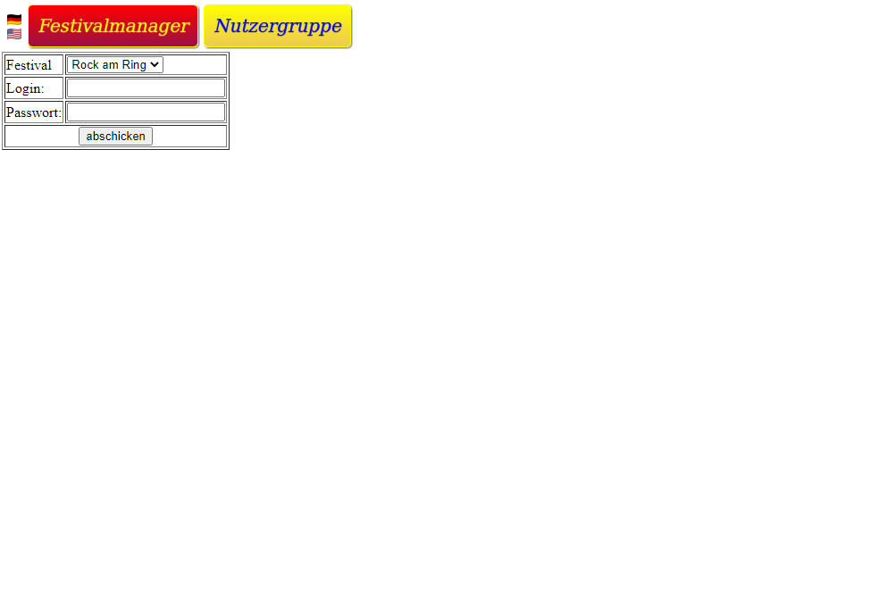
image::models/analysis/ui/ScrSht 2.png[]
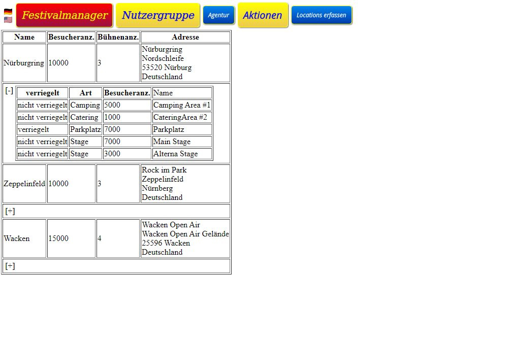
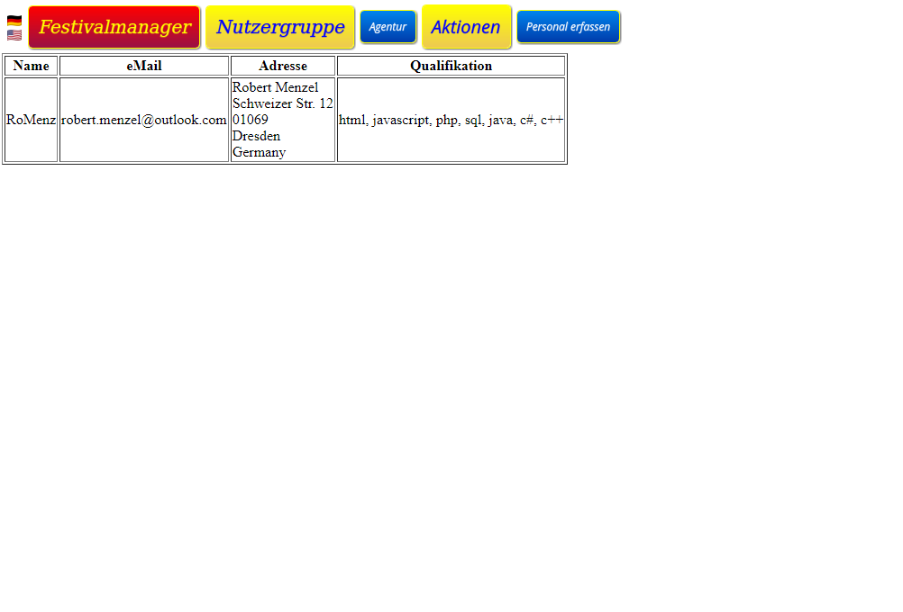
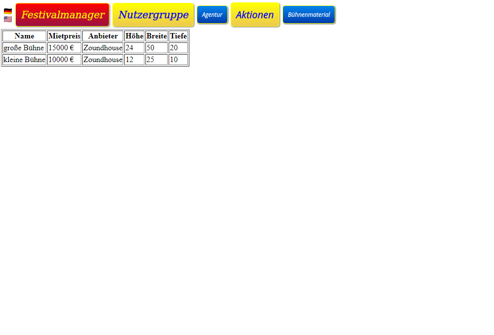
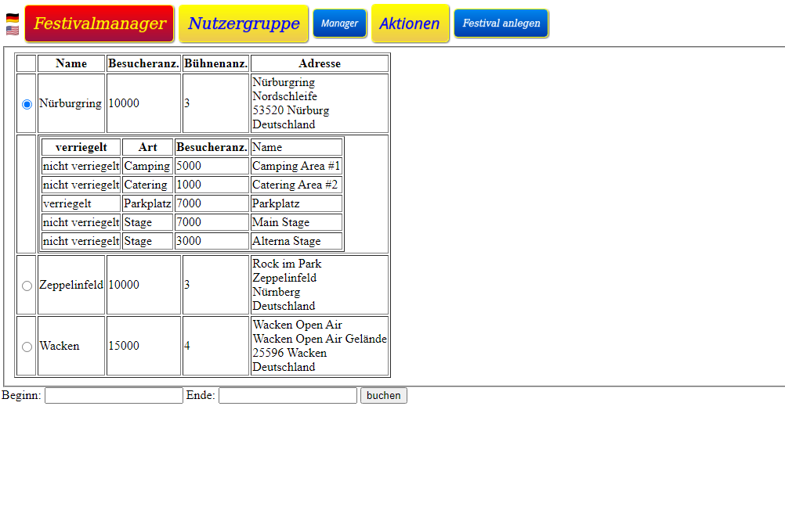
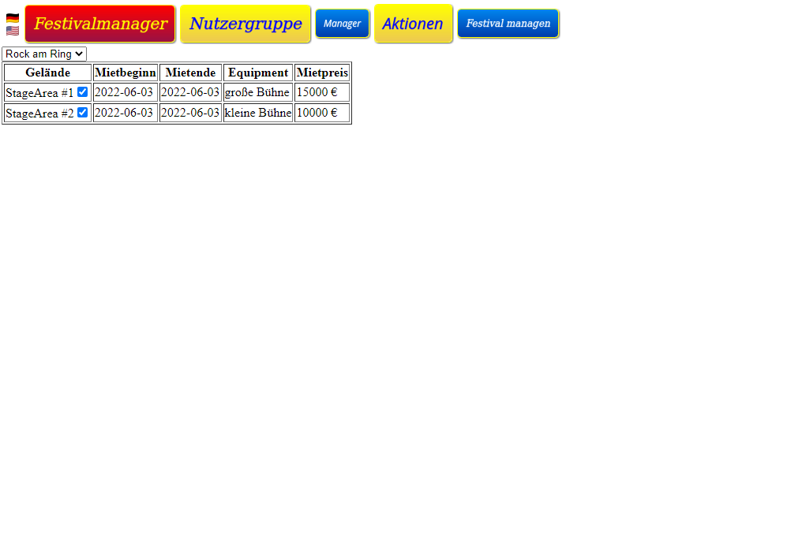
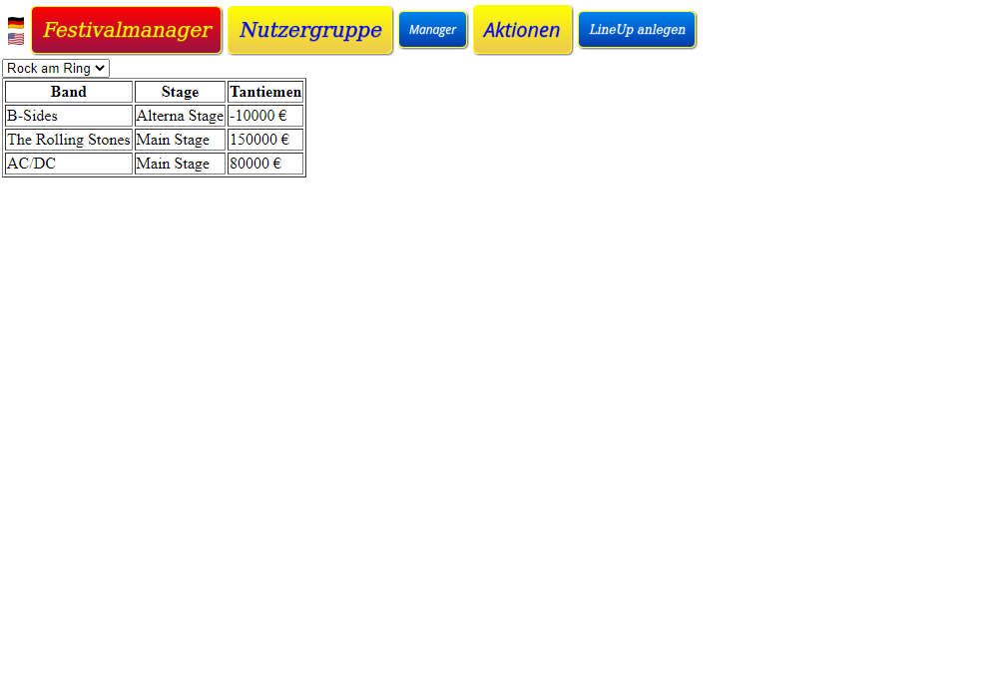
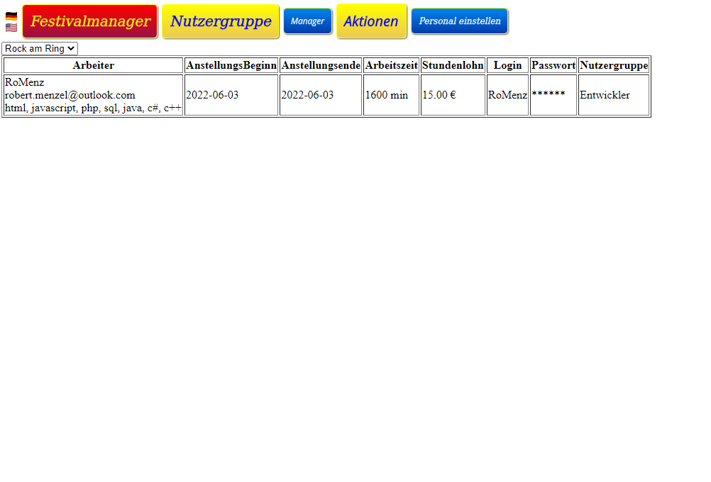

[#9_2]
=== Dialogbeschreibung
Für jeden Dialog:

1. Kurze textuelle Dialogbeschreibung eingefügt: Was soll der jeweilige Dialog? Was kann man damit tun? Überblick?
2. Maskenentwürfe (Screenshot, Mockup)
3. Maskenelemente (Ein/Ausgabefelder, Aktionen wie Buttons, Listen, …)
4. Evtl. Maskendetails, spezielle Widgets

- Agentur – Bands erfassen
* Hier können dann die Bands von der Agentur eingepflegt werden.
     Dazu muss ein Bandname, eine Addresse, eine eMail und die Anzahl der Mitglieder angegeben werden.
- Agentur - Locations erfassen
* Hier können die Locations von der Agentur erfasst werden.
    Dazu müssen der Name, die Besucherzahl, die Bühnenanzahl und die Adresse angegeben werden.
	Pro Location können Bereiche eingepflegt werden.
	Die Bereiche haben eine Art (Camping, Parkplatz, Catering und Stage), eine Besucheranzahl und einen Namen.

- Agentur - Personal erfassen
* Hier wird das verfügbare Personal erfasst.
    Pro Arbeiter wird ein Nickname, eine eMail- Adresse, die Adresse und ein Text zur Qualifikation eingegeben.

- Agentur – Bühnenmaterial erfassen
* Hier wird das verfügbare Equipment erfasst.
    Für jedes Gerät wird ein Name, der Mietpreis pro Tag,  der Anbieter sowie Höhe, Breite und Tiefe eingegeben.

- Manager . Location buchen
* Hier muss ein Termin festgelegt werden und die passende Location gebucht werden.
    Doppelbuchungen der Location sind auf jeden Fall zu vermeiden.
    Jede Location bietet Platz für eine maximale Anzahl von Besuchern und Bühnen.
    Außerdem ist jede Location in verschiedene, eindeutig gekennzeichnete Bereiche unterteilt, die wiederum einen Teil der maximalen Besucherzahl fassen können und sich außerdem in Camping-, Park, Catering- und Stagebereiche einordnen lassen.

- Manager – Festival managen
* Sobald die Location gebucht ist können hier für dieses Festival Anpassungen durchgeführt werden, wie die Bühnenpositionierung, Toilettenbestückung, Cateringstände und es muss möglich sein, bestimmte Bereiche zu sperren.
    Die genannten Gegenstände werden von externen Anbietern gemietet.

- Manager – LineUp anlegen
* In dieser Phase muss das "Line Up" zusammengestellt werden.
    Dazu müssen Angebote bei bestimmten Künstlern eingeholt werden.
    Anschließend werden aus diesen Angeboten Künstler ausgewählt
    und es muss ein Spielplan für jede Bühne erstellt werden.
    Manager – Personal einstellen
    Neben den genannten Künstlern ist weiteres Personal erforderlich,
    wie Sicherheitspersonal (mindestens einer pro 100 Besuchern),
    Bedienung an den Cateringstanden,
    Bühnentechniker (Anzahl wird durch die Band bestimmt)
    sowie ein Veranstaltungsleiter.
    Jede Arbeitskraft wird dabei auf Stundenbasis bezahlt.

[#10]
== Datenmodell

[#10_1]
=== Überblick: Klassendiagramm
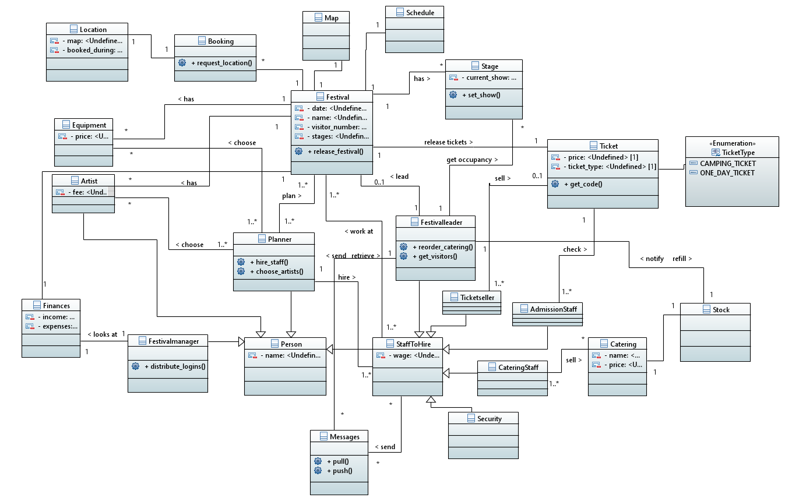

[#10_2]
=== Klassen und Enumerationen
[options="header"]
|===
|Klasse/Enumeration |Beschreibung
|Location |Ein Festivalgelände, das gebucht werden kann
|Booking |Buchungskomponente, die das Buchen der Locations verwaltet und Überschneidungen / Doppelbuchungen verhindert
|Map |Eine Karte eines Festivalgeländes mit Anpassungen für ein bestimmtes Festival (z.b. Bühnen- / Toilettenposition)
|Schedule |Der Zeitplan für das gesamte Festival (welcher Künstler spielt wann auf welcher Bühne)
|Stage |Eine Bühne, auf der ein Künstler spielen kann
|Festival |Repräsentation des gesamten Festivals
|Equipment |Geräte, die während dem Festival verwendet werden (Bühnen, Toiletten, ...)
|Ticket |Ein Ticket mit einer eindeutigen Nummer, das für den Einlass benötigt wird
|TicketType |Art des Tickets (Camping- oder Tagesticket)
|Artist |Ein Künstler, der auf einer Bühne auftreten kann
|Person |Eine Person, die an der Planung oder Umsetzung des Festivals arbeitet
|StaffToHire |Eine Person, die an der Planung oder Umsetzung des Festivals arbeitet und vom FestivalManager bezahlt wird
|Planner |Ein Angestellter der FVIV Gmbh, der Festivals plant
|FestivalLeader |Der Festivalleiter
|FestivalManager |Ein Manager der FVIV Gmbh. Er verteilt Logins an die Mitarbeiter
|TicketSeller |Ein Ticketverkäufer
|AdmissionStaff |Personal für die Eingangskontrolle
|Security |Sicherheitspersonal, das auf dem Festivalgelände für Ordnung sorgt
|CateringStaff |Verkäufer von Speißen und Getränken an Catering-Ständen
|Finances |Finanzsystem, das Ein- und Ausgaben speichert und die Gesamtkosten berechnet
|Stock |Das Lager für den Catering-Verkauf
|Catering |Ein Verkaufsstand für Speißen und Getränke auf dem Vestivalgelände
|Messages |Ein Nachrichtensystem, mit dem Mitarbeiter den Festivalleiter über verschiedene Sachen informieren können (z.b. wenn im Catering Zutaten aufgebraucht sind und nachbestellt werden müssen)
|===

[#11]
== Akzeptanztestfälle

:Pre: Vorbedingung(en)
:Event: Ereigniss
:Result: Erwartetes Ergebniss

[cols="1h, 4"]
|===
|ID            |<<AT0011>>
|Anwendungsfall|<<AF001>>
|{Pre}        a|
- Ein Ticket-Verkäufer ist eingeloggt

- Bis zum Eventbeginn sind noch mindestens drei Tage Zeit

- Es sind noch Tickets verfügbar
|{Event}      a|Der Verkäufer klickt "Ticket generieren"
und wählt die Art des Tickets aus
|{Result}     a|
- Ein Ticket mit Informationen zum Festival wird generiert

- Die generierte Ticketnummer wird auf keinem anderen Ticket für dieses Festival verwendet
|===

[cols="1h, 4"]
|===
|ID            |<<AT0012>>
|Anwendungsfall|<<AF001>>
|{Pre}        a|
- Ein Ticket-Verkäufer ist eingeloggt

- Bis zum Eventbeginn sind noch mindestens drei Tage Zeit

- Es sind keine Tageskarten mehr verfügbar
|{Event}      a|Der Verkäufer klickt "Ticket generieren" und wählt eine Tageskarte aus
|{Result}     a|Dem Verkäufer wird angezeigt, dass keine Tageskarten mehr verfügbar sind
|===

[cols="1h, 4"]
|===
|ID            |<<AT0021>>
|Anwendungsfall|<<AF002>>
|{Pre}        a|
- Die Abendkasse ist eröffnet

- Es sind Tickets für die Abendkasse verfügbar
|{Event}      a|Das Einlasspersonal prüft ob noch Tickets verfügbar sind
|{Result}     a|Dem Einlasspersonal wird angezeigt, dass noch Besucher eingelassen werden dürfen
|===

[cols="1h, 4"]
|===
|ID            |<<AT0022>>
|Anwendungsfall|<<AF002>>
|{Pre}        a|
- Die Abendkasse ist eröffnet

- Es sind keine Tickets für die Abendkasse mehr verfügbar
|{Event}      a|Das Einlasspersonal prüft ob noch Tickets verfügbar sind
|{Result}     a|Dem Einlasspersonal wird angezeigt, dass keine Besucher mehr eingelassen werden dürfen
|===

[cols="1h, 4"]
|===
|ID            |<<AT0031>>
|Anwendungsfall|<<AF003>>
|{Pre}        a|Ein Einlass-Mitarbeiter ist eingeloggt
|{Event}      a|Das Einlasspersonal bekommt ein gültiges Ticket gezeigt
|{Result}     a|
- Die Ticketnummer wird vom Programm bestätigt

- Die Ticketnummer wird für spätere Abfragen als ungültig markiert
|===

[cols="1h, 4"]
|===
|ID            |<<AT0032>>
|Anwendungsfall|<<AF003>>
|{Pre}        a|Ein Einlass-Mitarbeiter ist eingeloggt
|{Event}      a|Das Einlasspersonal bekommt ein Ticket gezeigt, was bereits
verwendet wurde
|{Result}     a|Das Programm erkennt, dass es sich um eine bereits benutzte Ticketnummer handelt
|===

[cols="1h, 4"]
|===
|ID            |<<AT0033>>
|Anwendungsfall|<<AF003>>
|{Pre}        a|Ein Einlass-Mitarbeiter ist eingeloggt
|{Event}      a|Das Einlasspersonal bekommt ein Ticket mit ungültiger Ticketnummer gezeigt
|{Result}     a|
Die Ticketnummer wird vom Programm nicht erkannt
|===

[cols="1h, 4"]
|===
|ID            |<<AT0041>>
|Anwendungsfall|<<AF004>>
|{Pre}        a|Ein Catering- oder Einlassmitarbeiter ist eingeloggt 
|{Event}      a|Der Mitarbeiter schreibt eine nichtleere Nachricht und schickt diese ab
|{Result}     a|Die Nachricht kann vom Festivalleiter gelesen werden
|===

[cols="1h, 4"]
|===
|ID            |<<AT0042>>
|Anwendungsfall|<<AF004>>
|{Pre}        a|Ein Catering- oder Einlassmitarbeiter ist eingeloggt 
|{Event}      a|Der Mitarbeiter versucht eine leere Nachricht abzuschicken
|{Result}     a|Es wird keine Nachricht abgeschickt
|===

[cols="1h, 4"]
|===
|ID            |<<AT0051>>
|Anwendungsfall|<<AF005>>
|{Pre}        a|Ein Catering-Mitarbeiter ist eingeloggt
|{Event}      a|
- Ein Besucher kauft einen Artikel der noch Ausreichend auf Lager ist

- Nach dem Kauf sind auch noch genügend Artikel auf Lager
|{Result}     a|Es wird keine Meldung an den Festivalleiter gesendet
|===

[cols="1h, 4"]
|===
|ID            |<<AT0052>>
|Anwendungsfall|<<AF005>>
|{Pre}        a|Ein Catering-Mitarbeiter ist eingeloggt
|{Event}      a|
- Ein Besucher kauft einen Artikel der noch Ausreichend auf Lager ist

- Nach dem Kauf sind nicht mehr genügend Artikel auf Lager
|{Result}     a|Es wird eine Meldung an den Festivalleiter gesendet
|===

[cols="1h, 4"]
|===
|ID            |<<AT0061>>
|Anwendungsfall|<<AF006>>
|{Pre}        a|Der Festivalleiter ist eingeloggt
|{Event}      a|Es wird ein Artikel von einem Besucher gekauft
|{Result}     a|Im Terminal des Festivalleiters verringert sich die Anzahl der verfügbaren Artikel um 1
|===

[cols="1h, 4"]
|===
|ID            |<<AT0062>>
|Anwendungsfall|<<AF006>>
|{Pre}        a|Der Festivalleiter ist eingeloggt
|{Event}      a|Der Festivalleiter bestellt 3 Stück eines Artikels nach
|{Result}     a|Der Lagerbestand des Artikels wird um 3 Stück erhöht 
|===

[cols="1h, 4"]
|===
|ID            |<<AT0071>>
|Anwendungsfall|<<AF007>>
|{Pre}        a|
- Der Festivalleiter ist eingeloggt

- Es gibt Bühnen auf denen Künstler spielen werden
|{Event}      a|Der Festivalleiter klickt auf "Bühnenbelegung" in der Navigationsleiste
|{Result}     a|Ihm wird entsprechend den Entscheidungen des Planungsteams angezeigt,
auf welcher Bühne welche Künstler zu welcher Uhrzeit spielen
|===

[cols="1h, 4"]
|===
|ID            |<<AT0072>>
|Anwendungsfall|<<AF007>>
|{Pre}        a|
- Der Festivalleiter ist eingeloggt

- Es wurden 2 Camping-Tickets und 2 Tageskarten verkauft
|{Event}      a|Der Festivalleiter klickt auf "Statistiken" in der Navigationsleiste
|{Result}     a|Ihm wird angezeigt, dass 2 Camping-Tickets und 2 Tageskarten verkauft wurden 
|===

[cols="1h, 4"]
|===
|ID            |<<AT0081>>
|Anwendungsfall|<<AF008>>
|{Pre}        a|Es ist kein Nutzer eingeloggt
|{Event}      a|Ein Besucher wählt "Lageplan" in der Navigationsleiste aus
|{Result}     a|Der Lageplan zum Festival wird angezeigt
|===

[cols="1h, 4"]
|===
|ID            |<<AT0082>>
|Anwendungsfall|<<AF008>>
|{Pre}        a|Es ist kein Nutzer eingeloggt
|{Event}      a|Ein Besucher wählt "Spielplan" in der Navigationsleiste aus
|{Result}     a|Der Spielplan zum Festvial wird angezeigt
|===

[cols="1h, 4"]
|===
|ID            |<<AT0091>>
|Anwendungsfall|<<AF009>>
|{Pre}        a|Ein Planer ist Eingeloggt
|{Event}      a|Der Planer holt im Tab "Personal und Künstler" ein Angebot für einen Künstler ein
|{Result}     a|Für den Künstler ist nun sichtbar, an welchen Zeiten er zu welcher Gage auftreten kann
|===

[cols="1h, 4"]
|===
|ID            |<<AT0092>>
|Anwendungsfall|<<AF009>>
|{Pre}        a|
- Ein Planer ist eingeloggt

- Es wurde mindestens von einem Künstler ein Angebot eingeholt
|{Event}      a|Der Planer weißt einen Künstler zu einer verfügbaren Zeit eine Bühne zu
|{Result}     a|Der Künstler wird zu dieser Zeit gebucht
|===

[cols="1h, 4"]
|===
|ID            |<<AT0101>>
|Anwendungsfall|<<AF010>>
|{Pre}        a|
- Ein Planer ist eingeloggt

- Es wurde noch keine Location ausgewählt
|{Event}      a|Ein Planer wählt eine Location aus der Liste der Locations aus, die 
im gewählten Zeitslot verfügbar sind
|{Result}     a|Die Location wird für das Festival gebucht
|===

[cols="1h, 4"]
|===
|ID            |<<AT0102>>
|Anwendungsfall|<<AF010>>
|{Pre}        a|
- Ein Planer ist eingeloggt

- Es wurde schon eine Location gewählt
|{Event}      a|Ein Planer wählt eine Belegung für eine Fäche der Location aus
|{Result}     a|Die Belegung wird für das Festival gebucht
|===

[cols="1h, 4"]
|===
|ID            |<<AT0111>>
|Anwendungsfall|<<AF011>>
|{Pre}        a|
- Ein Planer ist eingeloggt

- Das Festival kann bis zu 8000 Besucher haben
|{Event}      a|Der Planer trägt im Feld für die Anzahl der Sicherheitskräfte "80" ein
|{Result}     a|Die Anzahl der Sicherheitskräfte wird auf 80 gesetzt
|===

[cols="1h, 4"]
|===
|ID            |<<AT0112>>
|Anwendungsfall|<<AF011>>
|{Pre}        a|
- Ein Planer ist eingeloggt

- Das Festival kann bis zu 8000 Besucher haben
|{Event}      a|Der Planer trägt im Feld für die Anzahl der Sicherheitskräfte "70" ein
|{Result}     a|Dem Planer wird angezeigt, dass mindestens 80 Sicherheitskräfte gebucht werden müssen
|===

[cols="1h, 4"]
|===
|ID            |<<AT0121>>
|Anwendungsfall|<<AF012>>
|{Pre}        a|Ein Planer ist eingeloggt
|{Event}      a|Der Planer öffnet den "Kosten" Tab
|{Result}     a|Der Planer kann sehen welche Kosten das Festival verursacht
und wie viele Kosten die einzelnen Mitarbeiter und Mieten verursachen
|===

[cols="1h, 4"]
|===
|ID            |<<AT0122>>
|Anwendungsfall|<<AF012>>
- Ein Planer ist eingeloggt

- Ein Festival verursacht Kosten von 3 Millionen Euro

- Camping-Tickets kosten 300 Euro und Tageskarten 100 Euro
|{Event}      a|
- Der Planer öffnet den "Kosten" Tab

- Die Ticketpreis reicht bei den erwarteten Verkäufen von 5000 Camping-Tickets und 4000 Tageskarten nicht aus, um die Kosten zu decken
|{Result}     a|Der Planer kann sehen, dass die Ticketpreise nicht ausreichen hoch sind
|===

[cols="1h, 4"]
|===
|ID            |<<AT0131>>
|Anwendungsfall|<<AF013>>
|{Pre}        a|
- Es ist kein Benutzer angemeldet

- Folgende Accountdaten gehören zu einem Account mit Planer-Rolle

** Nutzername: Jan

** Passwort: test

|{Event}      a|Ein Benutzer klickt auf "Login" und gibt 
bei Nutzername "Jan" und bei Passwort "test" ein
|{Result}     a|Der Benutzer kann auf die Funktionen zu Planung von Festivals zugreifen
|===

[cols="1h, 4"]
|===
|ID            |<<AT0132>>
|Anwendungsfall|<<AF013>>
|{Pre}        a|
- Es ist kein Benutzer angemeldet

- Folgende Accountdaten gehören zu keinem Account

** Nutzername: Jan

** Passwort: test

|{Event}      a|Ein Benutzer klickt auf "Login" und gibt 
bei Nutzername "Jan" und bei Passwort "test" ein
|{Result}     a|Der Benutzer wird nicht angemeldet
|===

[cols="1h, 4"]
|===
|ID            |<<AT0133>>
|Anwendungsfall|<<AF013>>
|{Pre}        a|Ein Benutzer ist angemeldet
|{Event}      a|Der Benutzer klickt auf "Logout"
|{Result}     a|
- Der Benutzer ist nicht mehr angemeldet

- Er kann nicht mehr auf Funktionen einer bestimmten Rolle zugreifen
|===

[cols="1h, 4"]
|===
|ID            |<<AT0141>>
|Anwendungsfall|<<AF014>>
|{Pre}        a|
- Ein Planer ist eingeloggt

- Ein Festival verursacht Kosten von 1 Millionen Euro
|{Event}      a|
- Ein Planer setzt den Preis eines Tagestickets auf 200 Euro und den Preis 
eines Camping-Tickets auf 350 Euro

- Der Ticketpreis reicht bei den erwarteten Verkäufen von 6000 Camping-Tickets und 3000 Tageskarten aus, um die Kosten zu decken
|{Result}     a|Der Ticketpreis wird geändert
|===

[cols="1h, 4"]
|===
|ID            |<<AT0142>>
|Anwendungsfall|<<AF014>>
|{Pre}        a|
- Ein Planer ist eingeloggt 

- Ein Festival verursacht Kosten von 3 Millionen Euro
|{Event}      a|
- Ein Planer setzt den Preis eines Tagestickets auf 200 Euro und den Preis 
eines Camping-Tickets auf 350 Euro

- Der Ticketpreis reicht bei den erwarteten Verkäufen von 6000 Camping-Tickets und 3000 Tageskarten nicht aus, um die Kosten zu decken
|{Result}     a|
- Dem Planer wird eine Pop-up Warnung über die zu niedrigen Ticketpreise angezeigt

- Der Ticketpreis wird geändert
|===

[cols="1h, 4"]
|===
|ID            |<<AT0151>>
|Anwendungsfall|<<AF015>>
|{Pre}        a|
- Ein Ticket-Verkäufer ist eingeloggt

- Ein Camping-Ticket wurde generiert
|{Event}      a|Der Ticket-Verkäufer klickt Ticket ausdrucken
|{Result}     a|Ein Camping-Ticket mit der richtigen Ticketnummer wird ausgedruckt
|===

[cols="1h, 4"]
|===
|ID            |<<AT0152>>
|Anwendungsfall|<<AF015>>
|{Pre}        a|
- Ein Ticket-Verkäufer ist eingeloggt

- Ein Tagesticket wurde generiert
|{Event}      a|Der Ticket-Verkäufer klickt Ticket ausdrucken
|{Result}     a|Ein Tagesticket mit der richtigen Ticketnummer wird ausgedruckt
|===

[cols="1h, 4"]
|===
|ID            |<<AT0161>>
|Anwendungsfall|<<AF016>>
|{Pre}        a|Ein Planer ist eingeloggt
|{Event}      a|
- Der Planer klickt "Festival hinzufügen"

- Im vom Planer gewählten Zeitslot sind noch Locations verfügbar
|{Result}     a|Alle Planer können die Funktionen zur Festivalplanung auf das
hinzugefügte Festival anwenden
|===

[cols="1h, 4"]
|===
|ID            |<<AT0162>>
|Anwendungsfall|<<AF016>>
|{Pre}        a|Ein Planer ist eingeloggt
|{Event}      a|
- Der Planer klickt "Festival hinzufügen"

- Im vom Planer gewählten Zeitslot sind keine Locations mehr verfügbar
|{Result}     a|Dem Planer wird angezeigt, dass im gewählten Zeitslot 
keine Locations mehr verfügbar sind
|===

[cols="1h, 4"]
|===
|ID            |<<AT0171>>
|Anwendungsfall|<<AF017>>
|{Pre}        a|
- Der Manager ist Eingeloggt

- Es existiert noch kein Account mit Nutzernamen "Jan"
|{Event}      a|
- Der Manager klickt auf "Account anlegen"

- Er gibt die folgenden Nutzerdaten an: 
** Nutzername: Jan
** Passwort: test

|{Result}     a|Der Account wird angelegt
|===

[cols="1h, 4"]
|===
|ID            |<<AT0172>>
|Anwendungsfall|<<AF017>>
|{Pre}        a|
- Der Manager ist Eingeloggt

- Es existiert bereits ein Account mit Nutzernamen "Jan"
|{Event}      a|
- Der Manager klickt auf "Account anlegen"

- Er gibt die folgenden Nutzerdaten an: 
** Nutzername: Jan
** Passwort: test

|{Result}     a|Dem Manager wird angezeigt, dass er einen anderen Nutzernamen wählen muss
|===

[cols="1h, 4"]
|===
|ID            |<<AT0173>>
|Anwendungsfall|<<AF017>>
|{Pre}        a|Der Manager ist eingeloggt
|{Event}      a|Er klickt auf "Statistiken" in der Navigationsleiste
|{Result}     a|Im werden Betriebswirtschaftliche Informationen angezeigt
|===

[cols="1h, 4"]
|===
|ID            |<<AT0174>>
|Anwendungsfall|<<AF017>>
|{Pre}        a|Der Manager ist eingeloggt
|{Event}      a|Er klickt auf "Angemeldete Mitarbeiter" in der Navigationsleiste
|{Result}     a|Im wird angezeigt, welche Mitarbeiter aktuell eingeloggt sind
|===

[#12]
== Glossar

[#13]
== Offene Punkte
/
